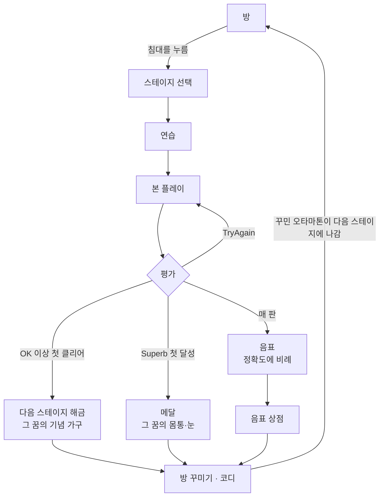
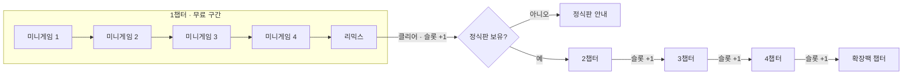
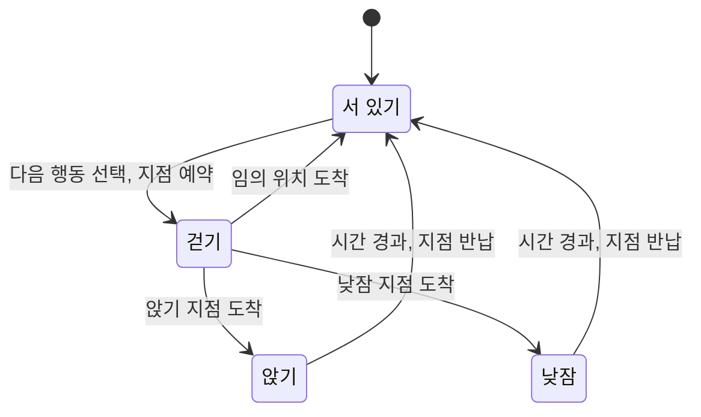
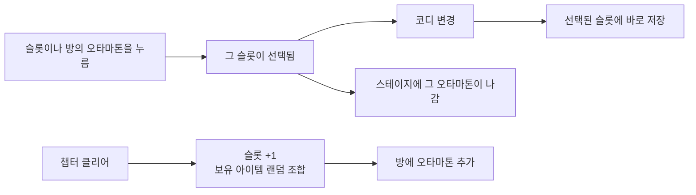
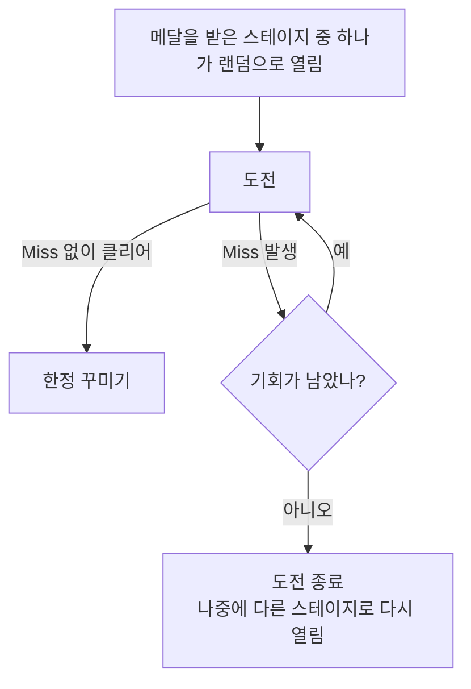
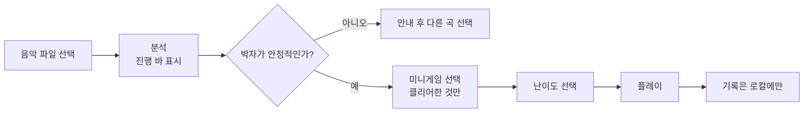

# 핵심 루프

## 1. 컨셉

- 오타마톤이 되고 싶은 것(꿈)을 하나씩 체험한다. **미니게임 하나 = 꿈 하나**다. 예: 받아치기 = 타자, 베기 = 검객.
- 오타마톤은 자기 방에서 지내다가 잠들면 꿈(스테이지)으로 간다. 꿈을 이루면 그 꿈의 기념품이 방에 놓인다.
- 장르는 리듬세상류 원버튼 리듬 게임이다. 큐(소리 + 연출)가 입력 타이밍을 알려 준다.

## 2. 루프 구조

| 층위 | 주기 | 내용 |
|---|---|---|
| 입력 | 1초 | 큐 → 입력 → 판정 피드백(입을 벌림, Miss면 Hit 눈) |
| 세션 | 1~3분 | 스테이지 플레이 → 평가 → 보상 |
| 메타 | 며칠~몇 주 | 챕터 진행, 메달 수집, 방과 오타마톤 꾸미기 |
| 장기 | 매일 | 퍼펙트 도전, 데일리 챌린지, 시즌 이벤트 |

### 2.1 세션 루프

루프의 핵심은 마지막 화살표다. 방과 코디를 꾸미면 그 모습이 다음 스테이지에 그대로 나가므로, 꾸미기가 다음 플레이의 동기가 된다.

### 2.2 평가

- 판정은 Perfect / Barely / Miss다. Barely는 절반 점수다.
- 정확도 = (Perfect + 0.5 × Barely) / 전체 노트 수.
- 랭크는 TryAgain(60% 미만) / OK(60% 이상) / Superb(80% 이상)이다. OK 이상이면 클리어다.

## 3. 챕터 구조

- 챕터 하나는 **미니게임 4개 + 리믹스 1개**다. 리믹스는 그 챕터의 미니게임 4개를 한 곡 안에서 번갈아 플레이하는 스테이지다.
- 출시 시점에는 4챕터(미니게임 16 + 리믹스 4 = 20스테이지)다.
- 챕터 안에서는 앞 스테이지를 OK 이상으로 깨면 다음 스테이지가 열린다. 리믹스를 깨면 다음 챕터가 열리고 오타마톤 슬롯이 하나 늘어난다.
- 1챕터 전체가 무료 구간이다(Steam 데모, 모바일 무료 구간). 1챕터 리믹스를 깬 직후에 정식판을 안내한다.
- 확장팩은 같은 단위(미니게임 4 + 리믹스 1)의 새 챕터로 낸다.

### 3.1 난이도

채보 생성기의 난이도(1~5)를 챕터에 나눠 쓴다.

| 챕터 | 생성 난이도 |
|---|---|
| 1챕터 | 1~2 |
| 2챕터 | 2~3 |
| 3챕터 | 3~4 |
| 4챕터 | 4~5 |

리믹스는 그 챕터 범위의 상한을 쓴다.

## 4. 방 (로비)

### 4.1 역할

로비는 오타마톤들의 방이고, 게임을 켜면 처음 보는 화면이다. 방에서 하는 일은 다음과 같다.

- 오타마톤 구경과 선택
- 방 꾸미기와 코디
- 스테이지 진입: 침대를 누르면 선택된 오타마톤이 침대로 가서 잠들고, 그대로 스테이지 선택(꿈)으로 넘어간다. 빠른 진입을 위해 고정 버튼도 함께 둔다.
- 설정

### 4.2 오타마톤 행동

- 보유한 슬롯 수만큼 방에 오타마톤이 있다.
- 오타마톤은 돌아다니고, 소파에 앉고, 낮잠을 잔다.
- **가구가 행동 지점을 가진다.** 예: 소파는 앉기 지점 2개, 침대는 낮잠 지점 1개. 가구를 바꾸면 오타마톤의 행동도 바뀐다.
- 한 행동 지점에는 한 마리만 들어간다. 걷기 시작할 때 지점을 예약하고, 행동이 끝나면 반납한다.
- 오타마톤을 누르면 입을 벌리며 반응하고(지금 로비 캐릭터와 같은 동작), 그 오타마톤이 선택된다. 선택된 오타마톤은 머리 위 표시 등으로 구분한다.

### 4.3 아트 원칙

몸통·눈 아이템이 늘어날 때 동작 그림이 곱으로 늘어나지 않게 한다.

- 동작은 기존 파츠(몸통 입 닫힘/열림, 눈)에 움직임 효과(통통 튀며 걷기, 기울기, 숨쉬기)를 입혀 표현한다.
- 새로 그리는 것은 눈 아이템마다 **잠든 눈 1장**까지로 제한한다.

### 4.4 방 꾸미기

- 정해진 자리마다 하나씩 고른다. 자리 목록(초안): 벽지, 바닥, 소파 자리, 침대 자리, 벽 장식, 창가, 전축.
- 자리 목록은 방 아트를 확정할 때 조정한다.
- 지금의 "로비 배경"은 벽지로, "로비 BGM"은 전축에 거는 레코드로 바뀐다.
- 자유 배치(끌어서 놓기)는 출시 범위 밖이다.

## 5. 오타마톤 슬롯

- 슬롯 하나 = 방 안의 오타마톤 한 마리 = 코디 하나다. UI에서는 "오타마톤 2호"처럼 캐릭터로 부른다.
- 처음에는 1개이고, 챕터(리믹스)를 깰 때마다 하나씩 늘어난다. 출시 시점 최대 5개이며, 확장팩 챕터를 깨면 더 늘어난다.
- 슬롯은 판매하지 않는다. 오타마톤이 늘어나는 것이 진행 정도를 보여 주는 표시이기 때문이다.
- 슬롯이나 방의 오타마톤을 누르면 그 슬롯이 선택(장착)된다.
- 코디를 바꾸면 선택된 슬롯에 바로 저장된다.
- 스테이지에는 선택된 슬롯의 오타마톤이 나간다.
- 새 슬롯은 보유한 몸통·눈의 랜덤 조합으로 시작한다. 늘어나자마자 방이 다채로워지게 하기 위해서다.

## 6. 꾸미기 체계

| 적용 범위 | 항목 |
|---|---|
| 슬롯마다 | 몸통, 눈, 음색 |
| 방 전체 | 벽지, 바닥, 가구 자리들, 레코드(BGM) |

- 꾸미기는 판정과 난이도에 영향을 주지 않는다.
- 음색은 플레이어 입력음(누를 때 오타마톤이 내는 소리)만 바꾼다. 큐 효과음은 판정 정보이므로 바꾸지 않는다.

## 7. 보상

| 조건 | 보상 | 출시 시점 수량 |
|---|---|---|
| 미니게임 첫 클리어(OK 이상) | 그 꿈의 기념 가구 (예: 타자 → 트로피 진열장, 검객 → 족자) | 16 |
| 미니게임 Superb | 메달 + 그 꿈의 몸통·눈 | 16 |
| 리믹스 Superb | 메달 | 4 |
| 챕터(리믹스) 첫 클리어 | 다음 챕터 + 오타마톤 슬롯 +1 | 4 |
| 메달 개수 | 아래 표 | 4단계 |
| 매 판 | 음표(정확도에 비례) | - |
| 음표 상점 | 일반 가구·파츠, 품목이 주기적으로 바뀜 | - |
| 퍼펙트 도전 성공 | 한정 꾸미기 | - |
| 데일리 챌린지 | 음표 | - |
| 유료 | 테마 세트, 음색 팩 ([02_BM.md](02_BM.md)) | - |

메달 개수 보상(초안):

| 메달 | 보상 |
|---|---|
| 5 | 벽지 |
| 10 | 바닥 + 하드 모드(미니게임을 한 단계 높은 생성 난이도로 플레이) |
| 15 | 특별 가구 |
| 20 | 특별 가구 세트 |

실력으로 얻는 보상(메달, 기념 가구, 꿈의 몸통·눈, 슬롯)은 판매하지 않는다.

## 8. 장기 콘텐츠

### 8.1 퍼펙트 도전

메달을 받은 스테이지 중 하나가 랜덤으로 열린다. 기회는 3번이고, Miss 없이 깨면 한정 꾸미기를 준다. 열리는 주기는 구현할 때 정한다.

### 8.2 데일리 챌린지

- 날짜를 시드로 기존 미니게임에 새 채보를 만든다. 모든 유저가 같은 채보로 플레이하고 리더보드로 겨룬다.
- 보상은 음표다.
- 참여 조건과 그날의 미니게임을 고르는 규칙은 구현할 때 정한다.
- 챕터 마지막 스테이지인 "리믹스"와 헷갈리지 않도록 "데일리 챌린지"라고 부른다.

### 8.3 시즌 이벤트

시즌 테마 꾸미기와, 기존 미니게임에 시즌 곡을 입힌 스테이지를 낸다.

## 9. 내 음악으로 플레이 (PC 전용)

플레이어의 로컬 음악 파일을 분석해 기존 미니게임의 채보를 만든다.

- 클리어한 미니게임만 고를 수 있다. 본편 진행과 묶기 위해서다.
- 본편에 포함한다. DLC로 팔지 않는다.
- 기록은 로컬에만 남기고 리더보드는 없다. 음원과 채보 공유도 출시 범위 밖이다.
- 템포가 바뀌거나 박자가 자유로운 곡은 분석 후 안내하고 다른 곡을 고르게 한다.
- 모바일은 저작권과 스토어 심사 문제로 제외한다.

## 10. 출시 후 아이디어

출시 범위 밖이다.

- 방의 다른 오타마톤이 스테이지에 조연으로 출연한다(받아치기의 투수, 관객 등).
- 가구 자유 배치.
