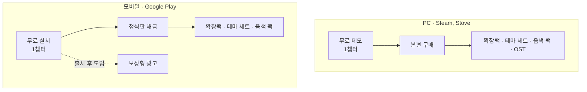

# 수익 모델 (BM)

## 1. 원칙

1. **콘텐츠는 사고, 꾸미기는 고른다.** 매출원을 제작비 구조에 맞춘다. 가장 비싼 콘텐츠인 미니게임(챕터)이 유료 상품이다.
2. **실력과 결제를 분리한다.** 판정 보정과 재도전 기회는 팔지 않는다. 메달, 기념 가구, 꿈의 몸통·눈, 오타마톤 슬롯도 판매하지 않는다.
3. **유료 확률형 상품을 두지 않는다.** 두면 확률 정보 공개 의무(2024년 3월 시행) 대상이 되고, 이 장르 유저의 반감도 크다. 유료 재화도 두지 않고 직접 구매만 쓴다.
4. **플레이 흐름 안에 광고를 넣지 않는다.** 리듬 게임에서 전면 광고는 이탈과 오디오 지연 문제를 같이 부른다.
5. **상품 목록은 하나, 판매 방식은 플랫폼 관례대로.** 상품 관리 부담을 줄이고, 각 플랫폼 유저가 익숙한 방식으로 판다.

## 2. 플랫폼별 구성

| | Steam | Stove | Google Play |
|---|---|---|---|
| 진입 | 무료 데모(1챕터) | 체험판(제공 방식 확인 필요) | 무료 설치, 1챕터 무료 |
| 본편 | 유료 | Steam과 같은 가격 | 정식판 해금 1회 구매, PC보다 낮게 |
| 추가 상품 | 확장팩, 테마 세트, 음색 팩, OST | Steam과 같음(OST는 확인 필요) | 확장팩, 테마 세트, 음색 팩 |
| 광고 | 없음 | 없음 | 보상형만, 출시 후 도입 |
| 본편 포함 기능 | 내 음악으로 플레이 | 내 음악으로 플레이 | - |
| 플랫폼 기능 | 업적, 리더보드, 클라우드 저장, Steam Deck 대응 | 로그인·소유권 확인(SDK), 그 밖의 기능은 확인 필요 | Play Games 업적·리더보드, 클라우드 저장 |
| 수수료 | 30% | 확인 필요 | 15%(연 매출 첫 100만 달러까지) |

### 2.1 Steam

- 리듬세상류 인디 게임(Melatonin, Bits & Bops, Rhythm Doctor)은 모두 유료 패키지로 자리 잡았다. 이 장르 유저는 F2P 장치에 리뷰로 반응한다.
- 핵심 지표는 데모 → 넥스트 페스트 → 위시리스트 수다.

### 2.2 Stove

- Steam과 같은 상품을 국내 유저 대상으로 판다.
- 로그인·소유권 확인용 Stove PC SDK를 따로 연동한다.
- 수수료, 인디 지원 프로그램, 체험판 제공 방식은 입점할 때 확인한다.

### 2.3 Google Play

- 모바일에서 유료 다운로드는 유입이 크게 줄어든다. 그래서 무료로 시작해 정식판을 해금하는 방식을 쓴다. Arcaea, Lanota가 쓰는 "무료 설치 + 유료 곡·챕터 팩" 모델을 변형한 것이다.
- 확장팩, 테마 세트, 음색 팩은 PC와 같은 상품 목록을 쓴다.

## 3. 상품 목록

| 상품 | 내용 | 비고 |
|---|---|---|
| 본편 / 정식판 해금 | 4챕터(20스테이지), 내 음악으로 플레이(PC) | |
| 확장팩 | 새 챕터 1개(미니게임 4 + 리믹스 1)와 그 챕터의 보상 | 출시 후 주력 상품. 오타마톤 슬롯은 구매만으로 주지 않고 챕터를 깨야 얻는다 |
| 테마 세트 | 벽지, 바닥, 가구, 몸통·눈 묶음 | 방이 생기면서 팔 수 있는 꾸미기가 크게 늘어난다 |
| 음색 팩 | 플레이어 입력음 | 큐 효과음은 바꾸지 않는다 |
| OST | 사운드트랙 | PC |

### 3.1 가격

미정이다. 아래는 가설이고 출시 전 시장 조사로 확정한다.

| 상품 | 가설 |
|---|---|
| PC 본편 | $9.99~14.99 |
| 모바일 정식판 해금 | PC 본편보다 낮게 |
| 확장팩, 테마 세트, 음색 팩 | 미정 |

## 4. 하지 않는 것

- 스태미나(에너지)
- 유료 확률형 상품(가챠), 유료 재화
- 실력 보상 판매: 메달 보상, 기념 가구, 꿈의 몸통·눈, 오타마톤 슬롯
- 판정 보정, 재도전 기회 판매
- 전면 광고
- 시즌 패스(출시 범위 밖, 5절 참고)

## 5. 출시 후 수익 계획

1. **확장팩(새 챕터)**: 주력 상품이다.
2. **테마 세트, 음색 팩 추가**
3. **보상형 광고(모바일)**: 출시 후 업데이트로 도입한다. 플레이 밖에서만, 유저가 원할 때 본다(예: 음표 2배). 실력 보상과는 연결하지 않는다.
4. **시즌 패스**: 꾸미기 제작 여력이 생기면 모바일에서만 검토한다.
   - 정해진 기간 동안 플레이로 경험치를 쌓아 단계별 보상을 받는 시스템이다. 무료 트랙은 누구나, 유료 트랙은 패스를 산 사람만 받는다.
   - 시즌마다 꾸미기를 20~30개씩 만들어야 하고, 한 번 시작하면 끊기 어렵다.
   - 유료로 산 PC 게임에 패스가 붙으면 반감이 크므로 PC에는 넣지 않는다.

## 6. 플랫폼 간 공유

- 출시 시점에는 플랫폼 간 진행과 구매를 공유하지 않는다. 플랫폼마다 자체 클라우드 저장만 쓴다.
- 공유하려면 자체 계정 서버가 필요하고, 다른 곳에서 산 상품을 쓰게 하는 데 대한 각 스토어의 정책도 확인해야 한다.
