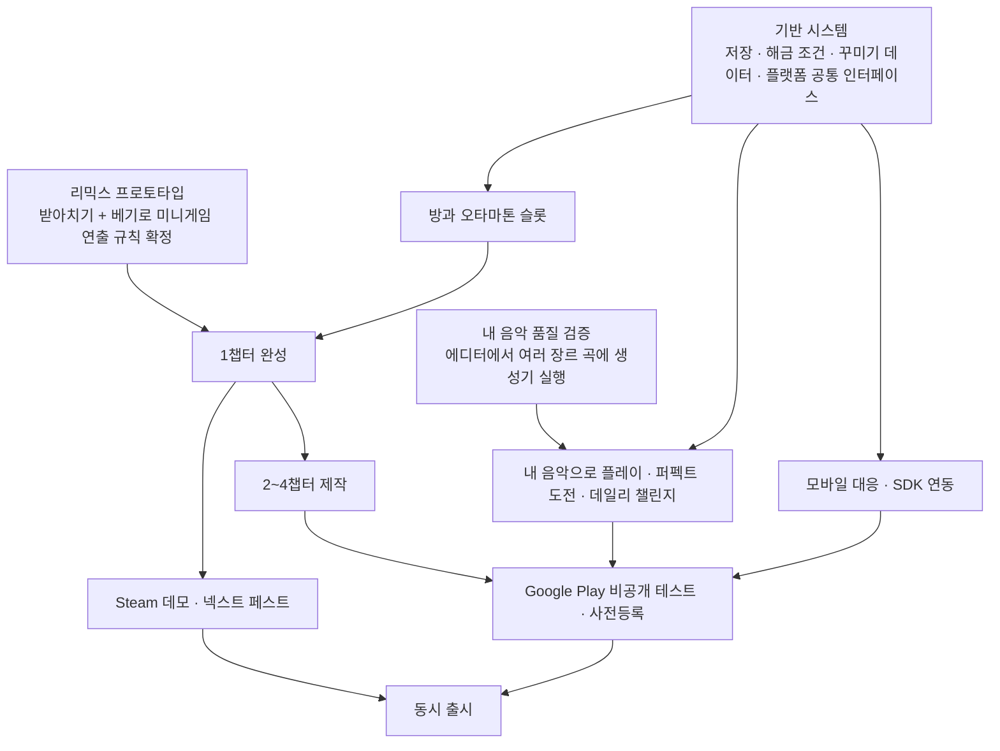
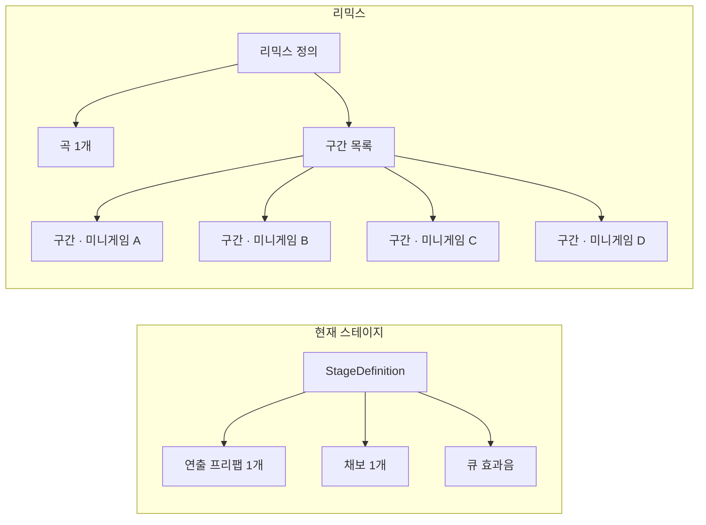

# 출시 계획

## 1. 출시 범위

### 1.1 콘텐츠

- 4챕터: 미니게임 16 + 리믹스 4. 현재 2개(받아치기, 베기)가 있으므로 미니게임 14개와 리믹스 4개를 더 만든다.
- 방: 기본 가구와 보상 가구(꿈의 기념 가구 16개, 메달 보상 등)
- 꾸미기: 꿈의 몸통·눈 16세트, 메달 보상, 음표 상점 품목, 출시 시점 유료 테마 세트와 음색 팩(수량 미정)

### 1.2 시스템

- 챕터 진행, 해금, 메달, 음표
- 방: 오타마톤 행동, 가구 자리, 오타마톤 슬롯
- 퍼펙트 도전, 데일리 챌린지
- 내 음악으로 플레이(PC)
- 결제, 업적, 리더보드, 클라우드 저장(플랫폼 3종)
- 입력 지연 보정 화면

### 1.3 출시 범위 밖

- 시즌 패스
- 보상형 광고(출시 후 업데이트)
- 플랫폼 간 진행·구매 공유
- 가구 자유 배치
- 내 음악으로 플레이의 공유 기능
- 다른 오타마톤의 스테이지 조연 출연

## 2. 동시 출시 준비

모바일을 먼저 일부 지역에 내서 검증하는 단계 없이 PC와 모바일을 동시에 낸다. 그래서 출시 전 검증과 모바일 전용 작업을 출시 범위에 넣는다.

### 2.1 출시 전 검증

| 수단 | 확인할 것 |
|---|---|
| Steam 데모(1챕터), 넥스트 페스트 | 재미, 1챕터 완주율, 위시리스트 수 |
| Google Play 비공개 테스트, 사전등록 | 모바일 플레이 감각, 입력 지연, 기기별 성능 |

개인 개발자 계정이면 프로덕션 출시 전에 비공개 테스트(테스터 12명 이상, 14일 이상)가 필수다. 정책이 바뀔 수 있으니 진행 시점에 다시 확인한다.

### 2.2 모바일 전용 작업

- 첫 실행 때 입력 지연 보정 화면(블루투스 이어폰 지연 대응). 보정값은 `PlayerCalibration`에 이미 있다.
- 무음 상태 감지와 안내
- 소리 없이도 알아볼 수 있게 시각 큐 보강
- 저사양 기기 성능
- 터치 입력

### 2.3 플랫폼 연동

| 플랫폼 | 연동 |
|---|---|
| Steam | Steamworks(소유권, 업적, 리더보드, 클라우드 저장, DLC) |
| Stove | Stove PC SDK(로그인, 소유권, 그 밖의 기능은 확인 필요) |
| Google Play | Google Play 결제, Play Games 서비스(업적, 리더보드, 클라우드 저장) |

### 2.4 그 밖의 준비

- 등급분류: Google Play는 IARC로 받는다. PC(Steam, Stove)로 국내에서 판매할 때의 등급분류 절차는 따로 확인한다.
- 스토어 설명에 "내 음악으로 플레이"가 PC 전용임을 표기한다.

## 3. 작업 순서

리믹스 프로토타입을 미니게임 양산보다 먼저 하는 이유: 모든 미니게임 연출이 곡 중간에 들어오고 나갈 수 있어야 리믹스가 된다. 이 규칙 없이 미니게임을 만들면 나중에 전부 고쳐야 한다.

## 4. 기술 요구 사항

### 4.1 리믹스

지금은 `StageDefinition` 하나가 연출 프리팹 하나, 채보 하나, 큐 효과음 목록으로 이루어지고, `StageRunner`가 연출 프리팹 하나를 만든다. 리믹스는 한 곡 안에서 여러 연출을 번갈아 써야 한다.

필요한 것:

- 구간마다 연출을 바꾸는 전환과 전환 연출
- 연출 여러 개를 함께 로드할 때의 메모리 관리
- 미니게임들의 큐 효과음 합치기. 미니게임끼리 `cueId`가 겹칠 수 있으므로 구분 규칙이 필요하다.
- 생성기가 구간마다 그 미니게임의 패턴 라이브러리를 쓰게 하기
- **미니게임 연출 규칙**: 곡 중간에 들어오고 나가기, 들어올 때 상태 초기화, 자기 구간의 큐와 패턴만 처리하기

### 4.2 저장

지금은 PlayerPrefs에 클리어한 스테이지 ID 목록(`StageProgress`)과 칸별 장착 항목 ID(`Wardrobe`)만 저장한다.

필요한 항목:

| 분류 | 항목 |
|---|---|
| 진행 | 스테이지별 최고 랭크·정확도·메달, 챕터 클리어, 퍼펙트 도전 상태 |
| 재화 | 음표 |
| 꾸미기 | 보유 항목, 슬롯별 코디(몸통·눈·음색), 선택된 슬롯, 방 자리별 가구 |
| 구매 | 플랫폼별 소유권(본편, 확장팩, 테마 세트, 음색 팩) |
| 설정 | 입력 지연 보정값 등 |

플랫폼 클라우드 저장에 올릴 수 있도록 하나의 저장 파일로 묶는다.

### 4.3 해금 조건

지금은 `CustomizationItem.unlockStageId` 하나(특정 스테이지 클리어)뿐이다. 다음 조건 타입으로 일반화한다.

- 스테이지 클리어
- 스테이지 Superb
- 메달 개수
- 챕터 클리어
- 구매(본편, 확장팩, 테마 세트, 음색 팩)
- 음표 상점 구매
- 퍼펙트 도전 성공
- 이벤트

### 4.4 꾸미기 데이터

지금의 칸(`WardrobeSlot`)은 Body, Eyes, Background, Bgm이다. 다음처럼 나눈다.

| 적용 범위 | 칸 | 기존 칸과의 관계 |
|---|---|---|
| 슬롯마다 | 몸통, 눈, 음색 | Body, Eyes 유지, 음색 추가 |
| 방 전체 | 벽지, 바닥, 가구 자리들, 레코드 | Background → 벽지, Bgm → 레코드 |

- 눈 파츠(`OtamatonEyes`)에 잠든 눈을 추가한다.
- 지금은 오타마톤 모습이 `OtamatonAppearance` 하나(전역)라서 로비·스테이지 캐릭터가 모두 같은 모습을 따라간다. 방에는 슬롯마다 다른 모습이 필요하고, 스테이지에는 선택된 슬롯의 모습이 나가야 한다.

### 4.5 방

- 오타마톤 행동 상태(서 있기, 걷기, 앉기, 낮잠)
- 가구의 행동 지점과 지점 예약
- 오타마톤 여러 마리 동시 표시, 누르면 선택, 선택 표시
- 침대를 누르면 잠드는 연출 후 스테이지 선택으로 전환

### 4.6 데일리 챌린지

- 채보 생성기는 런타임에서 쓸 수 있는 어셈블리(`IWannabe.Rhythm.Core`)에 있고 시드 기반이다.
- 곡 분석 결과(`SongAnalysis`)와 패턴 라이브러리(`PatternLibrary`)는 에디터 전용이라 런타임 데이터로 옮겨야 한다.
- 플랫폼마다 부동소수 계산 결과가 달라 같은 시드로도 채보가 갈릴 수 있다. 리더보드 공정성을 위해 채보를 미리 생성해 Addressables 원격 콘텐츠로 배포하는 방식을 권장한다.

### 4.7 내 음악으로 플레이

- 채보 파이프라인(`ChartPipeline`)과 패턴 라이브러리를 런타임으로 옮긴다.
- 런타임에서 읽을 수 있는 오디오 포맷(wav, ogg, mp3)을 검증한다.
- 긴 곡도 멈추지 않도록 분석은 백그라운드 스레드에서 돌리고 진행을 표시한다.
- 박자가 안정적인지 판정하는 기준을 정한다.

### 4.8 플랫폼 공통 인터페이스

결제(소유권 확인 포함), 업적, 리더보드, 클라우드 저장을 공통 인터페이스로 두고, 플랫폼별 구현(Steamworks, Stove PC SDK, Google Play 결제 + Play Games 서비스)을 갈아 끼운다.

### 4.9 콘텐츠 배포

Addressables 원격 카탈로그로 확장팩, 이벤트, 데일리 챌린지 채보를 스토어 업데이트 없이 배포한다.
