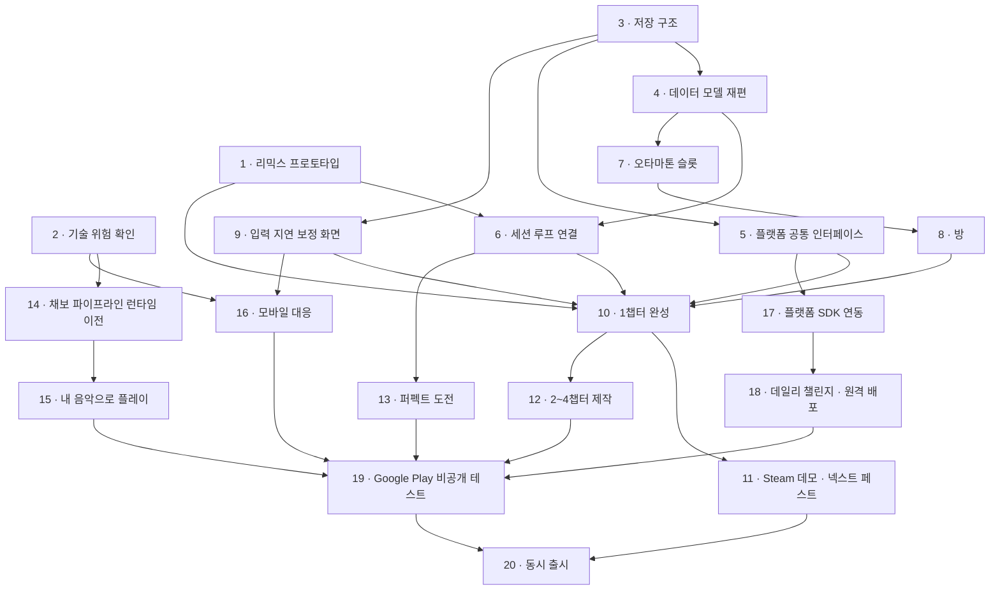

# 개발 로드맵

[03_LaunchPlan.md](03_LaunchPlan.md)의 작업 순서를 실제로 진행할 단계로 나눈 문서다. 여러 세션에 걸쳐 이 문서를 기준으로 작업을 이어 간다.

## 이 문서 쓰는 법

- 세션을 시작하면 "현재 위치"를 읽고, 그 단계의 상세를 읽은 뒤 작업한다.
- 할 일을 끝내면 체크리스트에 표시한다.
- 세션을 끝낼 때 "현재 위치", "진행 상태", "작업 기록"을 갱신한다.
- 미결 사항이 정해지면 해당 단계의 상세에 반영하고 미결 사항 목록에서 지운다.
- 단계의 완료 조건을 모두 만족해야 그 단계를 완료로 바꾼다.

## 현재 위치

| 항목 | 내용 |
|---|---|
| 진행 중 | 없음 |
| 다음 할 일 | 1단계 리믹스 프로토타입. 2단계 기술 위험 확인과 같이 진행할 수 있다 |
| 마지막 갱신 | 2026-10-08 |

## 진행 상태

상태는 대기 / 진행 / 완료로 적는다.

| 단계 | 작업 | 상태 | 선행 단계 | 관련 문서 |
|---|---|---|---|---|
| 1 | 리믹스 프로토타입 | 대기 | - | [03](03_LaunchPlan.md) 4.1 |
| 2 | 기술 위험 확인 | 대기 | - | [01](01_CoreLoop.md) 9, [03](03_LaunchPlan.md) 2.2 |
| 3 | 저장 구조 | 대기 | - | [03](03_LaunchPlan.md) 4.2 |
| 4 | 데이터 모델 재편 | 대기 | 3 | [03](03_LaunchPlan.md) 4.3, 4.4 |
| 5 | 플랫폼 공통 인터페이스 | 대기 | 3 | [03](03_LaunchPlan.md) 4.8 |
| 6 | 세션 루프 연결 | 대기 | 1, 4 | [01](01_CoreLoop.md) 2.1, 7 |
| 7 | 오타마톤 슬롯 | 대기 | 4 | [01](01_CoreLoop.md) 5 |
| 8 | 방 | 대기 | 7 | [01](01_CoreLoop.md) 4, [03](03_LaunchPlan.md) 4.5 |
| 9 | 입력 지연 보정 화면 | 대기 | 3 | [03](03_LaunchPlan.md) 2.2 |
| 10 | 1챕터 완성 | 대기 | 1, 5, 6, 8, 9 | [01](01_CoreLoop.md) 3 |
| 11 | Steam 데모 · 넥스트 페스트 | 대기 | 10 | [03](03_LaunchPlan.md) 2.1 |
| 12 | 2~4챕터 제작 | 대기 | 10 | [01](01_CoreLoop.md) 3, 7 |
| 13 | 퍼펙트 도전 | 대기 | 6 | [01](01_CoreLoop.md) 8.1 |
| 14 | 채보 파이프라인 런타임 이전 | 대기 | 2 | [03](03_LaunchPlan.md) 4.7 |
| 15 | 내 음악으로 플레이 (PC) | 대기 | 14 | [01](01_CoreLoop.md) 9 |
| 16 | 모바일 대응 | 대기 | 2, 9 | [03](03_LaunchPlan.md) 2.2 |
| 17 | 플랫폼 SDK 연동 | 대기 | 5 | [03](03_LaunchPlan.md) 2.3 |
| 18 | 데일리 챌린지 · 원격 콘텐츠 배포 | 대기 | 17 | [01](01_CoreLoop.md) 8.2, [03](03_LaunchPlan.md) 4.6, 4.9 |
| 19 | Google Play 비공개 테스트 · 사전등록 | 대기 | 12, 13, 15, 16, 17, 18 | [03](03_LaunchPlan.md) 2.1 |
| 20 | 동시 출시 | 대기 | 11, 19 | - |

## 작업 순서

화살표는 앞 단계가 끝나야 뒤 단계를 시작할 수 있다는 뜻이다. 화살표로 이어지지 않은 단계끼리는 함께 진행할 수 있다. 12단계(2~4챕터 제작)가 가장 길고, 13~18단계는 12단계와 함께 진행한다.

## 단계별 상세

### 1. 리믹스 프로토타입

받아치기와 베기를 한 곡 안에서 번갈아 플레이하게 만들어, 모든 미니게임이 따라야 할 **미니게임 연출 규칙**을 정한다. 미니게임을 더 만들기 전에 이 규칙이 정해져 있어야 한다.

지금은 `StageRunner`가 `StageDefinition.PresenterPrefab` 하나를 만들고, 큐 효과음은 `StageDefinition.TryGetCueSound`로 그 스테이지의 목록에서만 찾는다. `StagePresenter`에는 곡 중간에 들어오고 나가는 처리가 없다.

할 일:

- [ ] 리믹스 정의 데이터: 곡 1개와 구간 목록(구간마다 미니게임 하나)
- [ ] 연출 여러 개를 함께 로드하고 구간마다 바꾸기
- [ ] 구간 전환 연출
- [ ] `StagePresenter`에 구간 들어오기·나가기, 들어올 때 상태 초기화 추가
- [ ] 연출이 자기 구간의 큐와 패턴만 처리하게 하기
- [ ] 미니게임들의 큐 효과음 합치기와 `cueId` 구분 규칙
- [ ] 생성기가 구간마다 그 미니게임의 패턴 라이브러리를 쓰게 하기
- [ ] 연출 여러 개를 함께 로드할 때의 메모리 확인
- [ ] 연습 구간 규칙: 연습도 미니게임의 일부 구간만 쓰는 흐름이므로 같은 규칙에 맞춘다
- [ ] 시각 큐 기준: 소리 없이도 큐를 알아볼 수 있게 하는 공통 기준
- [ ] 정한 규칙을 `Docs/Design`에 문서로 남기기

완료 조건:

- 받아치기와 베기 구간이 번갈아 나오는 곡 하나를 처음부터 끝까지 플레이할 수 있다.
- 구간이 바뀌어도 판정과 점수가 이어지고, 앞 구간 연출의 상태나 큐가 다음 구간에 남지 않는다.
- 미니게임 연출 규칙(구간 들어오기·나가기, 연습, 시각 큐, `cueId` 구분)이 문서로 정리돼 있다.

관련 코드: `StageRunner`, `StagePresenter`, `StageDefinition`, `StageContentLoader`, `HitBackStagePresenter`, `SliceStagePresenter`, `ChartGenerator`, `PatternLibrary`

### 2. 기술 위험 확인

늦게 드러나면 범위나 설계를 바꿔야 하는 것을 미리 확인한다. 1단계와 함께 진행한다.

할 일:

- [ ] 여러 장르 곡에 에디터 생성기(`ChartPipeline`)를 돌려 채보 품질 확인. 템포가 일정한 곡, 템포가 바뀌는 곡, 박자가 자유로운 곡을 모두 넣는다
- [ ] 박자가 안정적인지 판정하는 기준 초안
- [ ] 테스트할 안드로이드 기기 정하기(저사양 기기 포함)
- [ ] 안드로이드 실기기 빌드로 오디오 지연 측정(유선, 블루투스)
- [ ] 터치 입력 반응 확인
- [ ] 저사양 기기 프레임 확인

완료 조건:

- 확인 결과가 작업 기록에 남아 있다.
- 범위나 설계를 바꿔야 할 문제가 있으면 미결 사항에 올라가 있다.

관련 코드: `ChartPipeline`, `SongAnalysis`, `AudioAnalyzer`, `Conductor`, `RhythmInput`

### 3. 저장 구조

저장할 것을 하나의 저장 파일로 묶는다. 플랫폼 클라우드 저장에 그대로 올릴 수 있어야 한다.

지금은 `StageProgress`(클리어한 스테이지 ID), `Wardrobe`(칸별 장착 항목 ID), `PlayerCalibration`(입력 지연 보정값)이 각각 PlayerPrefs에 저장한다.

할 일:

- [ ] 저장 데이터 정의

  | 분류 | 항목 |
  |---|---|
  | 진행 | 스테이지별 최고 랭크·정확도·메달, 챕터 클리어, 퍼펙트 도전 상태 |
  | 재화 | 음표 |
  | 꾸미기 | 보유 항목, 슬롯별 코디(몸통·눈·음색), 선택된 슬롯, 방 자리별 가구 |
  | 구매 | 플랫폼별 소유권(본편, 확장팩, 테마 세트, 음색 팩) |
  | 설정 | 입력 지연 보정값 등 |

- [ ] 직렬화 형식과 버전 필드(나중에 구조가 바뀌어도 이전 파일을 읽을 수 있게)
- [ ] 로컬 파일 저장·불러오기와 파일이 깨졌을 때의 대비
- [ ] `StageProgress`, `Wardrobe`, `PlayerCalibration`의 저장을 저장 파일로 옮기기

완료 조건:

- 진행, 꾸미기, 보정값이 저장 파일 하나에 저장되고 앱을 다시 켜도 유지된다.
- 게임 데이터가 PlayerPrefs에 남지 않는다.

관련 코드: `StageProgress`, `Wardrobe`, `PlayerCalibration`

### 4. 데이터 모델 재편

챕터, 해금 조건, 꾸미기 칸을 기획서 구조에 맞게 바꾼다.

할 일:

- [ ] 챕터 데이터: `StageCatalog`를 챕터 단위(미니게임 4 + 리믹스 1)로 묶고, 챕터마다 생성 난이도 범위를 둔다
- [ ] 해금 조건 일반화: `CustomizationItem.unlockStageId`를 조건 타입으로 바꾼다(스테이지 클리어, 스테이지 Superb, 메달 개수, 챕터 클리어, 구매, 음표 상점 구매, 퍼펙트 도전 성공, 이벤트)
- [ ] 스테이지 해금(`StageCatalog.IsUnlocked`)도 같은 조건 체계로 판정
- [ ] 꾸미기 칸 분리: 슬롯마다(몸통, 눈, 음색)와 방 전체(벽지, 바닥, 가구 자리들, 레코드). `Background`는 벽지로, `Bgm`은 레코드로 바꾼다
- [ ] 오타마톤 모습을 전역(`OtamatonAppearance`)에서 슬롯마다로 바꾼다
- [ ] 눈 파츠(`OtamatonEyes`)에 잠든 눈 추가

완료 조건:

- 새 데이터 구조로 지금의 로비와 스테이지가 이전과 같이 동작한다(슬롯 1개, 기존 꾸미기 항목 유지).

관련 코드: `StageCatalog`, `CustomizationCatalog`, `Wardrobe`, `OtamatonAppearance`, `OtamatonParts`, `CustomizationSetup`

### 5. 플랫폼 공통 인터페이스

결제(소유권 확인 포함), 업적, 리더보드, 클라우드 저장을 공통 인터페이스로 둔다. 실제 SDK는 17단계에서 붙이고, 그 전까지는 임시 구현으로 개발한다.

할 일:

- [ ] 인터페이스 정의: 결제·소유권, 업적, 리더보드, 클라우드 저장
- [ ] 에디터와 개발 빌드용 임시 구현. 소유권을 켜고 끌 수 있게 한다
- [ ] 저장(3단계)이 클라우드 저장 인터페이스를 거치게 하기
- [ ] 빌드 대상에 따라 구현을 고르는 방식

완료 조건:

- 임시 구현으로 정식판 보유 / 미보유를 바꿔 가며 테스트할 수 있다.

### 6. 세션 루프 연결

스테이지 진입부터 보상까지 세션 루프를 잇는다.

지금은 `StageRunner`가 끝날 때 OK 이상이면 `StageProgress.MarkCleared`만 부른다.

할 일:

- [ ] 연습 → 본 플레이 흐름(1단계에서 정한 연습 규칙대로)
- [ ] 결과 화면: 랭크, 정확도, 받은 보상
- [ ] OK 이상 첫 클리어: 다음 스테이지 해금, 그 꿈의 기념 가구
- [ ] Superb 첫 달성: 메달, 그 꿈의 몸통·눈
- [ ] 매 판: 음표(정확도에 비례)
- [ ] 리믹스 첫 클리어: 다음 챕터 해금, 오타마톤 슬롯 +1
- [ ] TryAgain이면 다시 하기

완료 조건:

- 스테이지를 깨면 보상이 저장되고 로비에 반영된다.

관련 코드: `StageRunner`, `StageFlow`, `StageHud`, `ScoreTracker`

### 7. 오타마톤 슬롯

슬롯 하나 = 오타마톤 한 마리 = 코디 하나를 구현한다.

할 일:

- [ ] 보유 슬롯 수만큼 오타마톤 표시
- [ ] 슬롯이나 오타마톤을 누르면 그 슬롯이 선택되고, 선택된 오타마톤을 표시(머리 위 표시 등)
- [ ] 코디를 바꾸면 선택된 슬롯에 바로 저장
- [ ] 스테이지에 선택된 슬롯의 모습으로 나가기
- [ ] 새 슬롯은 보유한 몸통·눈의 랜덤 조합으로 시작
- [ ] 음색: 선택된 슬롯의 음색으로 플레이어 입력음 재생(큐 효과음은 바꾸지 않는다)
- [ ] UI 호칭("오타마톤 2호")

완료 조건:

- 슬롯 2개 이상이 각각 다른 코디를 유지하고, 선택한 슬롯의 모습과 음색으로 스테이지에 나간다.

관련 코드: `Wardrobe`, `CustomizationPopup`, `WardrobeCellView`, `LobbyCharacter`, `OtamatonView`, `SfxPlayer`

### 8. 방

로비를 오타마톤들의 방으로 바꾼다.

할 일:

- [ ] 방 아트와 가구 자리 목록 확정(초안: 벽지, 바닥, 소파 자리, 침대 자리, 벽 장식, 창가, 전축)
- [ ] 오타마톤 행동 상태: 서 있기, 걷기, 앉기, 낮잠
- [ ] 가구의 행동 지점. 걷기 시작할 때 지점을 예약하고 행동이 끝나면 반납한다
- [ ] 움직임 효과(통통 튀며 걷기, 기울기, 숨쉬기)와 잠든 눈
- [ ] 침대를 누르면 선택된 오타마톤이 침대로 가서 잠들고 스테이지 선택으로 전환. 빠른 진입용 고정 버튼도 둔다
- [ ] 가구 자리마다 고르는 UI. 로비 배경은 벽지로, 로비 BGM은 레코드로 바꾼다
- [ ] 음표 상점(품목이 주기적으로 바뀜)

완료 조건:

- 여러 오타마톤이 방에서 지내고, 가구를 바꾸면 행동이 달라진다.
- 침대를 눌러 스테이지에 들어갈 수 있다.
- 음표로 상점 품목을 살 수 있다.

관련 코드: `LobbyController`, `LobbyCharacter`, `LobbyBackground`, `LobbyBgm`, `StageButtonView`, `CustomizationPopup`

### 9. 입력 지연 보정 화면

보정값(`PlayerCalibration.InputOffsetMs`)은 이미 있고 `StageRunner`가 판정에 반영한다. 값을 맞추는 화면을 만든다.

할 일:

- [ ] 박자에 맞춰 누르면 평균 오차로 보정값을 제안하는 화면, 직접 조정도 가능
- [ ] 설정에서 다시 열기
- [ ] 모바일 첫 실행 때 자동으로 열기(16단계에서 연결해도 된다)

완료 조건:

- 화면에서 보정값을 맞추고 저장할 수 있고, 판정에 반영된다.

관련 코드: `PlayerCalibration`, `StageRunner`

### 10. 1챕터 완성

1챕터(미니게임 4 + 리믹스 1)를 데모로 낼 수 있는 상태로 만든다.

할 일:

- [ ] 받아치기, 베기를 1단계 규칙에 맞게 고치기
- [ ] 미니게임 2개 추가(1단계 규칙대로)
- [ ] 1챕터 리믹스
- [ ] 생성 난이도 1~2로 채보 만들기. 리믹스는 2
- [ ] 1챕터 보상: 기념 가구 4개, 꿈의 몸통·눈 4세트
- [ ] 1챕터 리믹스를 깬 직후 정식판 안내(소유권은 5단계 인터페이스로 확인)
- [ ] 데모 빌드에서 2챕터 이후 막기

완료 조건:

- 처음 켠 상태에서 1챕터 리믹스까지 막힘 없이 플레이할 수 있고, 보상이 모두 지급된다.

1챕터 미니게임 현황(2~4챕터도 미니게임이 정해지면 같은 형식으로 추가한다):

| 미니게임 | 꿈 | 상태 |
|---|---|---|
| 받아치기 | 타자 | 프로토타입 있음, 1단계 규칙 반영 필요 |
| 베기 | 검객 | 프로토타입 있음, 1단계 규칙 반영 필요 |
| 미정 | 미정 | 대기 |
| 미정 | 미정 | 대기 |
| 리믹스 | - | 대기 |

### 11. Steam 데모 · 넥스트 페스트

위시리스트는 시간이 지나야 쌓이므로 1챕터가 끝나는 대로 데모를 낸다.

할 일:

- [ ] Steam 스토어 페이지(스크린샷, 트레일러, 설명). "내 음악으로 플레이"가 PC 전용임을 표기
- [ ] 데모 빌드(1챕터)
- [ ] 넥스트 페스트 일정 확인과 참가 신청
- [ ] 1챕터 완주율을 확인할 방법
- [ ] 받은 피드백을 정리해 12단계에 반영

완료 조건:

- 데모가 공개돼 있다.

### 12. 2~4챕터 제작

미니게임 12개와 리믹스 3개를 만든다. 가장 긴 단계이며 13~18단계와 함께 진행한다.

할 일:

- [ ] 2챕터: 미니게임 4 + 리믹스, 생성 난이도 2~3
- [ ] 3챕터: 미니게임 4 + 리믹스, 생성 난이도 3~4
- [ ] 4챕터: 미니게임 4 + 리믹스, 생성 난이도 4~5
- [ ] 미니게임마다 기념 가구, 꿈의 몸통·눈
- [ ] 메달 개수 보상(5, 10, 15, 20)과 하드 모드
- [ ] 출시 시점 유료 테마 세트와 음색 팩

완료 조건:

- 20스테이지와 그 보상이 모두 들어가 있다.

### 13. 퍼펙트 도전

할 일:

- [ ] 열리는 주기 정하기
- [ ] 메달을 받은 스테이지 중 하나를 랜덤으로 열기
- [ ] 기회 3번, Miss 없이 깨면 한정 꾸미기
- [ ] 도전 상태 저장

완료 조건:

- 퍼펙트 도전이 열리고, 성공하면 한정 꾸미기를, 기회를 다 쓰면 나중에 다른 스테이지로 다시 열린다.

### 14. 채보 파이프라인 런타임 이전

"내 음악으로 플레이"를 위해 채보 만들기를 빌드에서 돌릴 수 있게 한다. 분석과 생성 코어는 이미 `IWannabe.Rhythm.Core`에 있다.

할 일:

- [ ] `ChartPipeline`, `PatternLibrary`, `SongAnalysis`를 `IWannabe.Rhythm.Editor`에서 런타임 어셈블리로 옮기기
- [ ] 런타임에서 읽을 오디오 포맷(wav, ogg, mp3) 검증
- [ ] 분석을 백그라운드 스레드에서 돌리고 진행 표시

완료 조건:

- 빌드에서 로컬 음악 파일로 채보를 만들 수 있고, 긴 곡도 화면이 멈추지 않는다.

관련 코드: `ChartPipeline`, `PatternLibrary`, `SongAnalysis`, `AudioAnalyzer`, `ChartGenerator`

### 15. 내 음악으로 플레이 (PC)

할 일:

- [ ] 음악 파일 선택 → 분석(진행 바) → 박자가 안정적이지 않으면 안내하고 다른 곡 선택
- [ ] 클리어한 미니게임만 선택, 난이도 선택
- [ ] 기록은 로컬에만 저장
- [ ] PC 빌드에서만 켜기

완료 조건:

- PC 빌드에서 내 음악 파일로 클리어한 미니게임을 플레이하고 기록이 남는다.

### 16. 모바일 대응

할 일:

- [ ] 터치 입력
- [ ] 첫 실행 때 입력 지연 보정(9단계 화면)
- [ ] 무음 상태 감지와 안내
- [ ] 모든 미니게임이 1단계의 시각 큐 기준을 지키는지 점검
- [ ] 저사양 기기 성능

완료 조건:

- 2단계에서 정한 테스트 기기에서 20스테이지를 플레이할 수 있다.

### 17. 플랫폼 SDK 연동

5단계 인터페이스 뒤에 실제 구현을 붙인다.

할 일:

- [ ] Steamworks: 소유권, 업적, 리더보드, 클라우드 저장, DLC
- [ ] Stove PC SDK: 로그인, 소유권(그 밖의 기능은 입점할 때 확인)
- [ ] Google Play 결제, Play Games 서비스(업적, 리더보드, 클라우드 저장)
- [ ] 업적 목록 정하기
- [ ] 상품 등록: 본편 / 정식판 해금, 확장팩, 테마 세트, 음색 팩, OST(PC)

완료 조건:

- 플랫폼 3종 빌드에서 구매, 업적, 리더보드, 클라우드 저장이 동작한다.

### 18. 데일리 챌린지 · 원격 콘텐츠 배포

채보를 미리 만들어 원격으로 배포하는 방식이면 14단계(런타임 이전)가 필요 없다.

할 일:

- [ ] 참여 조건과 그날의 미니게임을 고르는 규칙 정하기
- [ ] 날짜별 채보를 에디터에서 미리 만들어 Addressables 원격 카탈로그로 배포
- [ ] 원격 콘텐츠를 올릴 곳 정하기
- [ ] 리더보드 연결(17단계)
- [ ] 보상: 음표
- [ ] 같은 원격 카탈로그로 확장팩과 이벤트를 배포할 수 있게 준비

완료 조건:

- 스토어 업데이트 없이 그날의 데일리 챌린지가 열리고, 모든 유저가 같은 채보로 리더보드에서 겨룬다.

### 19. Google Play 비공개 테스트 · 사전등록

할 일:

- [ ] 비공개 테스트 정책 다시 확인(개인 개발자 계정은 테스터 12명 이상, 14일 이상)
- [ ] 테스터 모집과 비공개 테스트 진행
- [ ] 사전등록 열기
- [ ] 입력 지연과 기기별 성능 피드백 반영

완료 조건:

- 프로덕션 출시 조건을 만족한다.

### 20. 동시 출시

할 일:

- [ ] Steam, Stove, Google Play 공개 일정 맞추기
- [ ] 출시 빌드 최종 점검

완료 조건:

- 세 스토어에 출시돼 있다.

## 개발 외 준비

기다리는 시간이 길어서 개발과 함께 일찍 시작한다.

| 항목 | 상태 | 필요한 시점 | 관련 문서 |
|---|---|---|---|
| Stove 입점 조건 확인(수수료, 인디 지원 프로그램, 체험판 제공 방식, OST 판매) | 대기 | 17단계 전 | [02](02_BM.md) 2.2 |
| 등급분류: Google Play IARC, 국내 PC 판매 절차 | 대기 | 20단계 전 | [03](03_LaunchPlan.md) 2.4 |
| 가격 시장 조사 | 대기 | 17단계 전 | [02](02_BM.md) 3.1 |
| Steam 스토어 페이지, 넥스트 페스트 일정 | 대기 | 11단계 전 | [03](03_LaunchPlan.md) 2.1 |
| Google Play 개발자 계정, 비공개 테스트 정책 | 대기 | 19단계 전 | [03](03_LaunchPlan.md) 2.1 |

## 미결 사항

| 항목 | 정할 단계 |
|---|---|
| 미니게임 연출 규칙 상세(구간 들어오기·나가기, `cueId` 구분) | 1 |
| 연습 구간 규칙 | 1 |
| 시각 큐 기준 | 1 |
| 박자가 안정적인지 판정하는 기준 | 2, 15 |
| 테스트할 안드로이드 기기 | 2 |
| 음표 지급 공식(정확도 비례) | 6 |
| 방 가구 자리 목록(방 아트 확정 시) | 8 |
| 음표 상점 품목 교체 주기 | 8 |
| 1챕터에 추가할 미니게임 2개(꿈) | 10 |
| 1챕터 완주율을 확인할 방법 | 11 |
| 2~4챕터 미니게임 목록(꿈) | 12 |
| 출시 시점 유료 테마 세트·음색 팩 수량 | 12 |
| 퍼펙트 도전 열리는 주기 | 13 |
| 업적 목록 | 17 |
| 데일리 챌린지 참여 조건, 그날의 미니게임 규칙 | 18 |
| 원격 콘텐츠를 올릴 곳 | 18 |

## 작업 기록

최근 기록을 위에 쓴다.

| 날짜 | 단계 | 한 일 | 남은 일 |
|---|---|---|---|
| 2026-10-08 | - | 로드맵 문서 작성 | 1단계 시작 |
