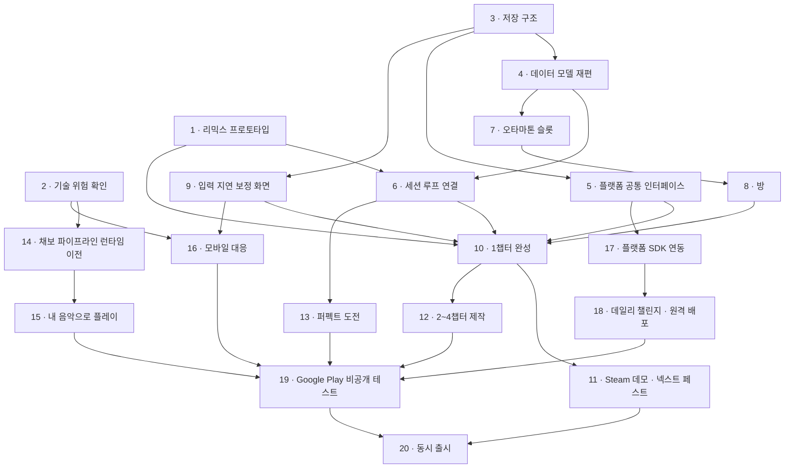

# 개발 로드맵

[03_LaunchPlan.md](03_LaunchPlan.md)의 작업 순서를 실제로 진행할 단계로 나눈 문서다. 여러 세션에 걸쳐 이 문서를 기준으로 작업을 이어 간다.

## 이 문서 쓰는 법

- 세션을 시작하면 "현재 위치"를 읽고, 그 단계의 상세를 읽은 뒤 작업한다.
- 할 일을 끝내면 체크리스트에 표시한다.
- 세션을 끝낼 때 "현재 위치", "진행 상태", "작업 기록"을 갱신한다.
- 미결 사항이 정해지면 해당 단계의 상세에 반영하고 미결 사항 목록에서 지운다.
- 단계의 완료 조건을 모두 만족해야 그 단계를 완료로 바꾼다.

## 현재 위치

| 항목 | 내용 |
|---|---|
| 진행 중 | 없음 |
| 다음 할 일 | 3단계 저장 구조(선행 단계 없음). 2단계가 끝나 14단계(채보 파이프라인 런타임 이전)도 시작할 수 있다. 에디터 빌드 대상은 Android로 둔다 |
| 마지막 갱신 | 2026-10-08 |

## 진행 상태

상태는 대기 / 진행 / 완료로 적는다.

| 단계 | 작업 | 상태 | 선행 단계 | 관련 문서 |
|---|---|---|---|---|
| 1 | 리믹스 프로토타입 | 완료 | - | [03](03_LaunchPlan.md) 4.1, [05](05_MinigameRules.md) |
| 2 | 기술 위험 확인 | 완료 | - | [01](01_CoreLoop.md) 9, [03](03_LaunchPlan.md) 2.2 |
| 3 | 저장 구조 | 대기 | - | [03](03_LaunchPlan.md) 4.2 |
| 4 | 데이터 모델 재편 | 대기 | 3 | [03](03_LaunchPlan.md) 4.3, 4.4 |
| 5 | 플랫폼 공통 인터페이스 | 대기 | 3 | [03](03_LaunchPlan.md) 4.8 |
| 6 | 세션 루프 연결 | 대기 | 1, 4 | [01](01_CoreLoop.md) 2.1, 7 |
| 7 | 오타마톤 슬롯 | 대기 | 4 | [01](01_CoreLoop.md) 5 |
| 8 | 방 | 대기 | 7 | [01](01_CoreLoop.md) 4, [03](03_LaunchPlan.md) 4.5 |
| 9 | 입력 지연 보정 화면 | 대기 | 3 | [03](03_LaunchPlan.md) 2.2 |
| 10 | 1챕터 완성 | 대기 | 1, 5, 6, 8, 9 | [01](01_CoreLoop.md) 3 |
| 11 | Steam 데모 · 넥스트 페스트 | 대기 | 10 | [03](03_LaunchPlan.md) 2.1 |
| 12 | 2~4챕터 제작 | 대기 | 10 | [01](01_CoreLoop.md) 3, 7 |
| 13 | 퍼펙트 도전 | 대기 | 6 | [01](01_CoreLoop.md) 8.1 |
| 14 | 채보 파이프라인 런타임 이전 | 대기 | 2 | [03](03_LaunchPlan.md) 4.7 |
| 15 | 내 음악으로 플레이 (PC) | 대기 | 14 | [01](01_CoreLoop.md) 9 |
| 16 | 모바일 대응 | 대기 | 2, 9 | [03](03_LaunchPlan.md) 2.2 |
| 17 | 플랫폼 SDK 연동 | 대기 | 5 | [03](03_LaunchPlan.md) 2.3 |
| 18 | 데일리 챌린지 · 원격 콘텐츠 배포 | 대기 | 17 | [01](01_CoreLoop.md) 8.2, [03](03_LaunchPlan.md) 4.6, 4.9 |
| 19 | Google Play 비공개 테스트 · 사전등록 | 대기 | 12, 13, 15, 16, 17, 18 | [03](03_LaunchPlan.md) 2.1 |
| 20 | 동시 출시 | 대기 | 11, 19 | - |

## 작업 순서

화살표는 앞 단계가 끝나야 뒤 단계를 시작할 수 있다는 뜻이다. 화살표로 이어지지 않은 단계끼리는 함께 진행할 수 있다. 12단계(2~4챕터 제작)가 가장 길고, 13~18단계는 12단계와 함께 진행한다.

## 단계별 상세

### 1. 리믹스 프로토타입

받아치기와 베기를 한 곡 안에서 번갈아 플레이하게 만들어, 모든 미니게임이 따라야 할 **미니게임 연출 규칙**을 정한다. 미니게임을 더 만들기 전에 이 규칙이 정해져 있어야 한다.

정한 규칙은 [05_MinigameRules.md](05_MinigameRules.md)에 있다. 구조는 다음과 같이 바꿨다.

- 미니게임 단위 데이터 `MinigameDefinition`(연출 프리팹, 큐 효과음, 화면 색)을 따로 두고, `StageDefinition`은 곡·채보·미니게임 목록만 갖는다. Addressables도 미니게임마다 그룹(`Minigame_*`)을 둬서 스테이지 번들끼리 복사하지 않는다.
- 채보(`ChartData`)에 구간 목록(`ChartSegment`)을 두고 패턴마다 구간 번호를 붙였다. 구간이 없는 채보는 곡 전체가 한 구간이다.
- `StageRunner`가 미니게임마다 연출을 하나씩 만들어 두고, 구간 시작 박에 전환 연출 없이 바로 바꾼다. 채보가 나오는 중이어도 바꾸며, 입력이 남은 앞 구간 노트는 새 미니게임이 이어받는다.
- 리믹스 프로토타입 스테이지 "리믹스"(`remix1`)를 카탈로그 세 번째에 넣었다. 받아치기 곡 위에 받아치기·베기 6구간(8·8·8·4·4·5마디)이다.
- 자동 플레이(`IWannabe/Test/Auto Play All Stages`)로 모든 스테이지를 사람 손 없이 끝까지 돌려 볼 수 있다.

할 일:

- [x] 리믹스 정의 데이터: 곡 1개와 구간 목록(구간마다 미니게임 하나)
- [x] 연출 여러 개를 함께 로드하고 구간마다 바꾸기
- [x] 구간 전환 연출: 전환 연출 없이 구간 시작 박에 바로 바뀌고, 날아오는 중인 노트는 다음 미니게임이 이어받는다
- [x] `StagePresenter`에 구간 들어오기·나가기, 들어올 때 상태 초기화 추가
- [x] 연출이 자기 구간의 큐와 패턴만 처리하게 하기
- [x] 미니게임들의 큐 효과음 합치기와 `cueId` 구분 규칙
- [x] 생성기가 구간마다 그 미니게임의 패턴 라이브러리를 쓰게 하기
- [x] 연출 여러 개를 함께 로드할 때의 메모리 확인
- [x] 연습 구간 규칙: 연습도 미니게임의 일부 구간만 쓰는 흐름이므로 같은 규칙에 맞춘다
- [x] 시각 큐 기준: 소리 없이도 큐를 알아볼 수 있게 하는 공통 기준
- [x] 정한 규칙을 `Docs/Design`에 문서로 남기기

완료 조건:

- 받아치기와 베기 구간이 번갈아 나오는 곡 하나를 처음부터 끝까지 플레이할 수 있다.
- 구간이 바뀌어도 판정과 점수가 이어지고, 앞 구간 연출의 상태나 큐가 다음 구간에 남지 않는다.
- 미니게임 연출 규칙(구간 들어오기·나가기, 연습, 시각 큐, `cueId` 구분)이 문서로 정리돼 있다.

관련 코드: `StageRunner`, `StagePresenter`, `StageDefinition`, `MinigameDefinition`, `ChartData`, `ChartTimeline`, `StageContentLoader`, `HitBackStagePresenter`, `SliceStagePresenter`, `ChartGenerator`, `ChartPipeline`, `PatternLibrary`, `StageSetupBuilder`, `StageAutoPlayTest`

### 2. 기술 위험 확인

늦게 드러나면 범위나 설계를 바꿔야 하는 것을 미리 확인한다. 1단계와 함께 진행한다.

점검 도구:

- 채보 품질 리포트(`IWannabe/Test/Chart Quality Report`): 합성 곡 14개(정답 비트를 아는 곡: 고정 템포 7, 3박자 1, 천천히 흔들리는 템포 2, 템포 변화 2, 루바토 1, 박 없음 1)와 테스트 곡(`Assets/_Local/TestSongs`, git에 올리지 않음)을 분석하고, 받아치기·베기 생성 설정으로 채보를 만들어 지표를 `Reports/ChartQuality/report.md`에 남긴다. 곡마다 비트 클릭·채보 클릭을 얹은 WAV(`Reports/ChartQuality/songs`)도 남겨 귀로 확인할 수 있다.
- 기기 점검(`IWannabe/Device Check/Build Android and Install`): 개발 빌드 첫 씬 `DeviceCheck`에서 탭(소리·화면)으로 입력 어긋남, 마이크 루프백으로 출력 왕복 지연(DSP 버퍼 크기별), 터치 이벤트 시각, 스테이지 자동 플레이 프레임을 잰다. 결과는 화면, `adb logcat`의 `[DeviceCheck]`, 기기의 `device_check.txt`에 남는다. 기기 점검 씬은 이 빌드에만 들어가고 마이크 코드는 개발 빌드에만 들어간다.

할 일:

- [x] 여러 장르 곡에 에디터 생성기(`ChartPipeline`)를 돌려 채보 품질 확인. 템포가 일정한 곡, 템포가 바뀌는 곡, 박자가 자유로운 곡을 모두 넣는다(실제 곡은 템포가 일정한 곡뿐이라 나머지는 합성 곡으로 확인)
- [x] 박자가 안정적인지 판정하는 기준 초안(15단계 상세에 적음)
- [x] 테스트할 안드로이드 기기 정하기: 갤럭시 S24. 저사양 기기는 없어 미결 사항으로 넘김
- [x] 안드로이드 실기기 빌드로 오디오 지연 측정(스피커, 블루투스. S24는 이어폰 단자가 없어 유선은 16단계에서 USB-C 이어폰으로)
- [x] 터치 입력 반응 확인
- [x] 프레임 확인(S24. 저사양 기기는 확보한 뒤 16단계에서)

완료 조건:

- 확인 결과가 작업 기록에 남아 있다.
- 범위나 설계를 바꿔야 할 문제가 있으면 미결 사항에 올라가 있다.

관련 코드: `ChartPipeline`, `SongAnalysis`, `AudioAnalyzer`, `BeatStability`, `ChartQualityReport`, `SyntheticSongs`, `Conductor`, `RhythmInput`, `DeviceCheck`, `FrameCheckRunner`, `DeviceCheckBuild`

### 3. 저장 구조

저장할 것을 하나의 저장 파일로 묶는다. 플랫폼 클라우드 저장에 그대로 올릴 수 있어야 한다.

지금은 `StageProgress`(클리어한 스테이지 ID), `Wardrobe`(칸별 장착 항목 ID), `PlayerCalibration`(입력 지연 보정값)이 각각 PlayerPrefs에 저장한다.

할 일:

- [ ] 저장 데이터 정의

  | 분류 | 항목 |
  |---|---|
  | 진행 | 스테이지별 최고 랭크·정확도·메달, 챕터 클리어, 퍼펙트 도전 상태 |
  | 재화 | 음표 |
  | 꾸미기 | 보유 항목, 슬롯별 코디(몸통·눈·음색), 선택된 슬롯, 방 자리별 가구 |
  | 구매 | 플랫폼별 소유권(본편, 확장팩, 테마 세트, 음색 팩) |
  | 설정 | 입력 지연 보정값 등 |

- [ ] 직렬화 형식과 버전 필드(나중에 구조가 바뀌어도 이전 파일을 읽을 수 있게)
- [ ] 로컬 파일 저장·불러오기와 파일이 깨졌을 때의 대비
- [ ] `StageProgress`, `Wardrobe`, `PlayerCalibration`의 저장을 저장 파일로 옮기기

완료 조건:

- 진행, 꾸미기, 보정값이 저장 파일 하나에 저장되고 앱을 다시 켜도 유지된다.
- 게임 데이터가 PlayerPrefs에 남지 않는다.

관련 코드: `StageProgress`, `Wardrobe`, `PlayerCalibration`

### 4. 데이터 모델 재편

챕터, 해금 조건, 꾸미기 칸을 기획서 구조에 맞게 바꾼다.

할 일:

- [ ] 챕터 데이터: `StageCatalog`를 챕터 단위(미니게임 4 + 리믹스 1)로 묶고, 챕터마다 생성 난이도 범위를 둔다
- [ ] 해금 조건 일반화: `CustomizationItem.unlockStageId`를 조건 타입으로 바꾼다(스테이지 클리어, 스테이지 Superb, 메달 개수, 챕터 클리어, 구매, 음표 상점 구매, 퍼펙트 도전 성공, 이벤트)
- [ ] 스테이지 해금(`StageCatalog.IsUnlocked`)도 같은 조건 체계로 판정
- [ ] 꾸미기 칸 분리: 슬롯마다(몸통, 눈, 음색)와 방 전체(벽지, 바닥, 가구 자리들, 레코드). `Background`는 벽지로, `Bgm`은 레코드로 바꾼다
- [ ] 오타마톤 모습을 전역(`OtamatonAppearance`)에서 슬롯마다로 바꾼다
- [ ] 눈 파츠(`OtamatonEyes`)에 잠든 눈 추가

완료 조건:

- 새 데이터 구조로 지금의 로비와 스테이지가 이전과 같이 동작한다(슬롯 1개, 기존 꾸미기 항목 유지).

관련 코드: `StageCatalog`, `CustomizationCatalog`, `Wardrobe`, `OtamatonAppearance`, `OtamatonParts`, `CustomizationSetup`

### 5. 플랫폼 공통 인터페이스

결제(소유권 확인 포함), 업적, 리더보드, 클라우드 저장을 공통 인터페이스로 둔다. 실제 SDK는 17단계에서 붙이고, 그 전까지는 임시 구현으로 개발한다.

할 일:

- [ ] 인터페이스 정의: 결제·소유권, 업적, 리더보드, 클라우드 저장
- [ ] 에디터와 개발 빌드용 임시 구현. 소유권을 켜고 끌 수 있게 한다
- [ ] 저장(3단계)이 클라우드 저장 인터페이스를 거치게 하기
- [ ] 빌드 대상에 따라 구현을 고르는 방식

완료 조건:

- 임시 구현으로 정식판 보유 / 미보유를 바꿔 가며 테스트할 수 있다.

### 6. 세션 루프 연결

스테이지 진입부터 보상까지 세션 루프를 잇는다.

지금은 `StageRunner`가 끝날 때 OK 이상이면 `StageProgress.MarkCleared`만 부른다.

할 일:

- [ ] 연습 → 본 플레이 흐름([05](05_MinigameRules.md) 6절 연습 규칙대로)
- [ ] 결과 화면: 랭크, 정확도, 받은 보상
- [ ] OK 이상 첫 클리어: 다음 스테이지 해금, 그 꿈의 기념 가구
- [ ] Superb 첫 달성: 메달, 그 꿈의 몸통·눈
- [ ] 매 판: 음표(정확도에 비례)
- [ ] 리믹스 첫 클리어: 다음 챕터 해금, 오타마톤 슬롯 +1
- [ ] TryAgain이면 다시 하기

완료 조건:

- 스테이지를 깨면 보상이 저장되고 로비에 반영된다.

관련 코드: `StageRunner`, `StageFlow`, `StageHud`, `ScoreTracker`

### 7. 오타마톤 슬롯

슬롯 하나 = 오타마톤 한 마리 = 코디 하나를 구현한다.

할 일:

- [ ] 보유 슬롯 수만큼 오타마톤 표시
- [ ] 슬롯이나 오타마톤을 누르면 그 슬롯이 선택되고, 선택된 오타마톤을 표시(머리 위 표시 등)
- [ ] 코디를 바꾸면 선택된 슬롯에 바로 저장
- [ ] 스테이지에 선택된 슬롯의 모습으로 나가기
- [ ] 새 슬롯은 보유한 몸통·눈의 랜덤 조합으로 시작
- [ ] 음색: 선택된 슬롯의 음색으로 플레이어 입력음 재생(큐 효과음은 바꾸지 않는다)
- [ ] UI 호칭("오타마톤 2호")

완료 조건:

- 슬롯 2개 이상이 각각 다른 코디를 유지하고, 선택한 슬롯의 모습과 음색으로 스테이지에 나간다.

관련 코드: `Wardrobe`, `CustomizationPopup`, `WardrobeCellView`, `LobbyCharacter`, `OtamatonView`, `SfxPlayer`

### 8. 방

로비를 오타마톤들의 방으로 바꾼다.

할 일:

- [ ] 방 아트와 가구 자리 목록 확정(초안: 벽지, 바닥, 소파 자리, 침대 자리, 벽 장식, 창가, 전축)
- [ ] 오타마톤 행동 상태: 서 있기, 걷기, 앉기, 낮잠
- [ ] 가구의 행동 지점. 걷기 시작할 때 지점을 예약하고 행동이 끝나면 반납한다
- [ ] 움직임 효과(통통 튀며 걷기, 기울기, 숨쉬기)와 잠든 눈
- [ ] 침대를 누르면 선택된 오타마톤이 침대로 가서 잠들고 스테이지 선택으로 전환. 빠른 진입용 고정 버튼도 둔다
- [ ] 가구 자리마다 고르는 UI. 로비 배경은 벽지로, 로비 BGM은 레코드로 바꾼다
- [ ] 음표 상점(품목이 주기적으로 바뀜)

완료 조건:

- 여러 오타마톤이 방에서 지내고, 가구를 바꾸면 행동이 달라진다.
- 침대를 눌러 스테이지에 들어갈 수 있다.
- 음표로 상점 품목을 살 수 있다.

관련 코드: `LobbyController`, `LobbyCharacter`, `LobbyBackground`, `LobbyBgm`, `StageButtonView`, `CustomizationPopup`

### 9. 입력 지연 보정 화면

보정값(`PlayerCalibration.InputOffsetMs`)은 이미 있고 `StageRunner`가 판정에 반영한다. 값을 맞추는 화면을 만든다.

할 일:

- [ ] 박자에 맞춰 누르면 평균 오차로 보정값을 제안하는 화면, 직접 조정도 가능
- [ ] 설정에서 다시 열기
- [ ] 모바일 첫 실행 때 자동으로 열기(16단계에서 연결해도 된다)

완료 조건:

- 화면에서 보정값을 맞추고 저장할 수 있고, 판정에 반영된다.

관련 코드: `PlayerCalibration`, `StageRunner`

### 10. 1챕터 완성

1챕터(미니게임 4 + 리믹스 1)를 데모로 낼 수 있는 상태로 만든다.

할 일:

- [x] 받아치기, 베기를 1단계 규칙에 맞게 고치기(1단계에서 함께 반영)
- [ ] 미니게임 2개 추가([05](05_MinigameRules.md) 11절 체크리스트대로)
- [ ] 1챕터 리믹스
- [ ] 생성 난이도 1~2로 채보 만들기. 리믹스는 2
- [ ] 1챕터 보상: 기념 가구 4개, 꿈의 몸통·눈 4세트
- [ ] 1챕터 리믹스를 깬 직후 정식판 안내(소유권은 5단계 인터페이스로 확인)
- [ ] 데모 빌드에서 2챕터 이후 막기

완료 조건:

- 처음 켠 상태에서 1챕터 리믹스까지 막힘 없이 플레이할 수 있고, 보상이 모두 지급된다.

1챕터 미니게임 현황(2~4챕터도 미니게임이 정해지면 같은 형식으로 추가한다):

| 미니게임 | 꿈 | 상태 |
|---|---|---|
| 받아치기 | 타자 | 프로토타입 있음, 1단계 규칙 반영됨 |
| 베기 | 검객 | 프로토타입 있음, 1단계 규칙 반영됨 |
| 미정 | 미정 | 대기 |
| 미정 | 미정 | 대기 |
| 리믹스 | - | 프로토타입 있음(받아치기 곡 재사용, 받아치기·베기만). 1챕터 곡과 미니게임 4개로 다시 만들어야 함 |

### 11. Steam 데모 · 넥스트 페스트

위시리스트는 시간이 지나야 쌓이므로 1챕터가 끝나는 대로 데모를 낸다.

할 일:

- [ ] Steam 스토어 페이지(스크린샷, 트레일러, 설명). "내 음악으로 플레이"가 PC 전용임을 표기
- [ ] 데모 빌드(1챕터)
- [ ] 넥스트 페스트 일정 확인과 참가 신청
- [ ] 1챕터 완주율을 확인할 방법
- [ ] 받은 피드백을 정리해 12단계에 반영

완료 조건:

- 데모가 공개돼 있다.

### 12. 2~4챕터 제작

미니게임 12개와 리믹스 3개를 만든다. 가장 긴 단계이며 13~18단계와 함께 진행한다.

할 일:

- [ ] 2챕터: 미니게임 4 + 리믹스, 생성 난이도 2~3
- [ ] 3챕터: 미니게임 4 + 리믹스, 생성 난이도 3~4
- [ ] 4챕터: 미니게임 4 + 리믹스, 생성 난이도 4~5
- [ ] 미니게임마다 기념 가구, 꿈의 몸통·눈
- [ ] 메달 개수 보상(5, 10, 15, 20)과 하드 모드
- [ ] 출시 시점 유료 테마 세트와 음색 팩

완료 조건:

- 20스테이지와 그 보상이 모두 들어가 있다.

### 13. 퍼펙트 도전

할 일:

- [ ] 열리는 주기 정하기
- [ ] 메달을 받은 스테이지 중 하나를 랜덤으로 열기
- [ ] 기회 3번, Miss 없이 깨면 한정 꾸미기
- [ ] 도전 상태 저장

완료 조건:

- 퍼펙트 도전이 열리고, 성공하면 한정 꾸미기를, 기회를 다 쓰면 나중에 다른 스테이지로 다시 열린다.

### 14. 채보 파이프라인 런타임 이전

"내 음악으로 플레이"를 위해 채보 만들기를 빌드에서 돌릴 수 있게 한다. 분석과 생성 코어는 이미 `IWannabe.Rhythm.Core`에 있다.

할 일:

- [ ] `ChartPipeline`, `PatternLibrary`, `SongAnalysis`를 `IWannabe.Rhythm.Editor`에서 런타임 어셈블리로 옮기기
- [ ] 런타임에서 읽을 오디오 포맷(wav, ogg, mp3) 검증
- [ ] 분석을 백그라운드 스레드에서 돌리고 진행 표시

완료 조건:

- 빌드에서 로컬 음악 파일로 채보를 만들 수 있고, 긴 곡도 화면이 멈추지 않는다.

관련 코드: `ChartPipeline`, `PatternLibrary`, `SongAnalysis`, `AudioAnalyzer`, `ChartGenerator`

### 15. 내 음악으로 플레이 (PC)

할 일:

- [ ] 음악 파일 선택 → 분석(진행 바) → 박자가 안정적이지 않으면 안내하고 다른 곡 선택
- [ ] 클리어한 미니게임만 선택, 난이도 선택

박자 안정성 판정 기준 초안(2단계). 분석기가 곡마다 `BeatStability`를 내고, 기준값은 `BeatStabilityCriteria`에 있다.

| 판정 | 조건 | 처리(제안) |
|---|---|---|
| Stable | BPM 하나짜리 격자가 맞는다. 찾은 비트의 90% 이상이 격자 30ms 안이고 90번째 오차가 25ms 이하이거나, 곡의 온셋에 직접 맞춘 격자가 온셋이 있는 8박 창의 90% 이상에서 20ms 안에 맞는다 | 받는다(고정 템포로 채보) |
| Variable | 격자는 안 맞지만 템포가 천천히 흔들릴 뿐이다. 비트 흔들림 15ms 이하, 이웃한 8박 창 사이 템포 변화 6% 이하, 곡 전체 템포 폭 12% 이하 | 받는다(비트별 시각으로 채보). 미결 사항 참고 |
| Unstable | 그 밖(템포가 크게 바뀌거나 박자가 자유로움), 또는 박 위치 온셋이 박 안 평균의 1.6배 미만(박이 뚜렷하지 않음), 또는 비트를 8개도 못 찾음 | 안내하고 다른 곡을 고르게 한다 |

함께 붙는 표시: 비트를 찾은 구간이 곡의 70% 미만(LowCoverage), 3박자로 보임(TripleMeter), 박이 약함(WeakPulse).
- [ ] 기록은 로컬에만 저장
- [ ] PC 빌드에서만 켜기

완료 조건:

- PC 빌드에서 내 음악 파일로 클리어한 미니게임을 플레이하고 기록이 남는다.

### 16. 모바일 대응

할 일:

- [ ] 터치 입력
- [ ] 첫 실행 때 입력 지연 보정(9단계 화면)
- [ ] 무음 상태 감지와 안내
- [ ] 모든 미니게임이 1단계의 시각 큐 기준을 지키는지 점검
- [ ] 저사양 기기 성능

정해진 것:

- 출력 샘플레이트는 프로젝트 설정 그대로 둔다(0, 기기가 고름. S24는 24000Hz). S24에서 48000Hz와 들어 비교해 차이를 느끼지 못했다(2026-10-08).
- 오디오 설정(샘플레이트, DSP 버퍼)은 실행 중에 바꾸지 않는다. S24에서 실행 중에 48000Hz로 바꾸자 소리 탭이 -93 → -245ms, 루프백이 174 → 79ms로 버퍼 계산보다 크게 바뀌었다.

완료 조건:

- 2단계에서 정한 테스트 기기에서 20스테이지를 플레이할 수 있다.

### 17. 플랫폼 SDK 연동

5단계 인터페이스 뒤에 실제 구현을 붙인다.

할 일:

- [ ] Steamworks: 소유권, 업적, 리더보드, 클라우드 저장, DLC
- [ ] Stove PC SDK: 로그인, 소유권(그 밖의 기능은 입점할 때 확인)
- [ ] Google Play 결제, Play Games 서비스(업적, 리더보드, 클라우드 저장)
- [ ] 업적 목록 정하기
- [ ] 상품 등록: 본편 / 정식판 해금, 확장팩, 테마 세트, 음색 팩, OST(PC)

완료 조건:

- 플랫폼 3종 빌드에서 구매, 업적, 리더보드, 클라우드 저장이 동작한다.

### 18. 데일리 챌린지 · 원격 콘텐츠 배포

채보를 미리 만들어 원격으로 배포하는 방식이면 14단계(런타임 이전)가 필요 없다.

할 일:

- [ ] 참여 조건과 그날의 미니게임을 고르는 규칙 정하기
- [ ] 날짜별 채보를 에디터에서 미리 만들어 Addressables 원격 카탈로그로 배포
- [ ] 원격 콘텐츠를 올릴 곳 정하기
- [ ] 리더보드 연결(17단계)
- [ ] 보상: 음표
- [ ] 같은 원격 카탈로그로 확장팩과 이벤트를 배포할 수 있게 준비

완료 조건:

- 스토어 업데이트 없이 그날의 데일리 챌린지가 열리고, 모든 유저가 같은 채보로 리더보드에서 겨룬다.

### 19. Google Play 비공개 테스트 · 사전등록

할 일:

- [ ] 비공개 테스트 정책 다시 확인(개인 개발자 계정은 테스터 12명 이상, 14일 이상)
- [ ] 테스터 모집과 비공개 테스트 진행
- [ ] 사전등록 열기
- [ ] 입력 지연과 기기별 성능 피드백 반영

완료 조건:

- 프로덕션 출시 조건을 만족한다.

### 20. 동시 출시

할 일:

- [ ] Steam, Stove, Google Play 공개 일정 맞추기
- [ ] 출시 빌드 최종 점검

완료 조건:

- 세 스토어에 출시돼 있다.

## 개발 외 준비

기다리는 시간이 길어서 개발과 함께 일찍 시작한다.

| 항목 | 상태 | 필요한 시점 | 관련 문서 |
|---|---|---|---|
| Stove 입점 조건 확인(수수료, 인디 지원 프로그램, 체험판 제공 방식, OST 판매) | 대기 | 17단계 전 | [02](02_BM.md) 2.2 |
| 등급분류: Google Play IARC, 국내 PC 판매 절차 | 대기 | 20단계 전 | [03](03_LaunchPlan.md) 2.4 |
| 가격 시장 조사 | 대기 | 17단계 전 | [02](02_BM.md) 3.1 |
| Steam 스토어 페이지, 넥스트 페스트 일정 | 대기 | 11단계 전 | [03](03_LaunchPlan.md) 2.1 |
| Google Play 개발자 계정, 비공개 테스트 정책 | 대기 | 19단계 전 | [03](03_LaunchPlan.md) 2.1 |

## 미결 사항

| 항목 | 정할 단계 |
|---|---|
| 박자 안정성 기준 확정(초안은 15단계 상세) | 15 |
| 템포가 천천히 흔들리는 곡(Variable)을 내 음악에서 받을지. 기획서는 템포가 바뀌는 곡을 거절하지만, 이런 곡도 비트를 정확히 따라간다(합성 곡 ±20ms 안 100%, 테스트 곡 10개 중 1개가 130.0→130.7 BPM으로 흔들림) | 15 |
| 3박자 곡 처리. 지금은 감지만 하고 4박 마디로 나눈다(테스트 곡 03_andriih는 듣기로 3박자가 맞음을 확인. 박은 맞고 마디 첫 박만 4박마다 잡힌다) | 15 |
| 170 BPM 넘는 빠른 곡이 절반 템포로 잡힌다(박은 맞고 노트 밀도가 절반, 합성 곡에서 다운비트가 2·4박에 붙음) | 15 |
| 저사양 테스트 기기 확보(지금은 갤럭시 S24뿐) | 16 |
| 화면 방향. 지금 자동 회전이라 세로로도 돈다 | 16 |
| 안드로이드 출력 지연 추정. `Conductor`가 "버퍼 길이 × 버퍼 수"(S24 기본 85ms)를 빼는데 실제 지연은 훨씬 짧아, 보정 없이 하면 입력이 약 100ms 이르게 판정된다(S24 스피커 소리 탭 -108·-93ms). 기본 보정값이나 추정 방식을 정해야 한다 | 9, 16 |
| 출력 장치별 보정값. S24에서 블루투스가 스피커보다 약 200~300ms 늦고 잴 때마다 흔들렸다(중앙 +66·-43ms, 표준편차 52·119ms). 보정값을 출력 장치(스피커·유선·블루투스)마다 따로 저장하고, 블루투스는 정확한 플레이가 어렵다고 안내할지. 안드로이드는 블루투스를 연결해도 오디오가 다시 시작되지 않아(OnAudioConfigurationChanged 없음) 장치는 따로 알아내야 한다 | 9, 16 |
| 모바일 DSP 버퍼 크기. 프로젝트 설정 1024가 S24에서 512×4가 된다. 256이면 왕복 지연이 31ms 줄고 S24에서는 끊김 보고가 없었다. 저사양 기기에서 끊기는지 보고 정한다 | 16 |
| 곡 도중 오디오가 다시 시작될 때(블루투스 연결·해제 등) 처리. 지금은 음악이 멈추고 `Conductor`가 다시 틀지 않는다. 일시정지로 바꾸는 방안 | 16 |
| 안드로이드 패키지 이름·제품 이름이 템플릿 기본값(`com.UnityTechnologies.com.unity.template.urpblank`, `My project (1)`) | 17 |
| 음표 지급 공식(정확도 비례) | 6 |
| 방 가구 자리 목록(방 아트 확정 시) | 8 |
| 음표 상점 품목 교체 주기 | 8 |
| 1챕터에 추가할 미니게임 2개(꿈) | 10 |
| 1챕터 완주율을 확인할 방법 | 11 |
| 2~4챕터 미니게임 목록(꿈) | 12 |
| 출시 시점 유료 테마 세트·음색 팩 수량 | 12 |
| 퍼펙트 도전 열리는 주기 | 13 |
| 업적 목록 | 17 |
| 데일리 챌린지 참여 조건, 그날의 미니게임 규칙 | 18 |
| 원격 콘텐츠를 올릴 곳 | 18 |

## 작업 기록

최근 기록을 위에 쓴다.

| 날짜 | 단계 | 한 일 | 남은 일 |
|---|---|---|---|
| 2026-10-08 | 2 | S24 기기 점검 두 번째(샘플레이트 선택을 넣은 빌드). 스피커 24000Hz·512: 소리 탭 중앙 -93ms(첫 번째 -108ms와 비슷, 표준편차 58ms). 48000Hz로 실행 중에 바꾸자 소리 탭 -245ms, 루프백 79ms(24000Hz는 174ms)로 버퍼 계산보다 크게 바뀜. 블루투스(48000Hz·512): 소리 탭 +66ms·-43ms, 표준편차 52·119ms로 스피커보다 약 200~300ms 늦고 흔들림이 큼. 블루투스를 연결해도 오디오 장치 변경 이벤트가 오지 않음. 2단계 완료: 보정 화면·출력 장치별 보정·샘플레이트·DSP 버퍼·저사양 기기는 미결 사항으로 9·16단계에 넘김 | 유선(USB-C) 이어폰과 저사양 기기 측정은 16단계에서 기기 점검 빌드로 |
| 2026-10-08 | 2 | 갤럭시 S24(SM-S921N, Exynos·Xclipse 940, Android 16, 120Hz)에서 기기 점검. 오디오 기본 설정은 24000Hz·버퍼 512×4(추정 출력 지연 85ms). 프레임: 받아치기·베기·리믹스 자동 플레이 모두 평균 120fps, 99% 8.5ms, 최대 13.8ms, 끊김 0~1회, GC 스테이지당 2회, 할당 111MB. 소리 탭(스피커): 중앙 -108ms(표준편차 53ms), 화면 탭: 중앙 -25ms(표준편차 29ms) → 보정 없이 하면 입력이 약 100ms 이르게 판정된다(곡 시계가 빼는 85ms가 실제 출력 지연보다 큼). 루프백 왕복(스피커, 마이크 입력 지연 포함): 버퍼 256 143ms, 512 174ms, 1024 257ms. 블루투스 루프백은 클릭을 12개 중 3~9개만 잡아 쓸 수 없었다. 터치: 이벤트 시각이 처리 시각보다 13ms 앞서고(판정이 프레임 단위로 뭉개지지 않음) 이동 이벤트는 8ms 간격. 점검 중 고친 것: DSP 버퍼를 바꾸면 코드로 만든 클릭 클립이 무음이 되던 것(설정이 바뀌면 새로 만듦), 로비에서 기기 점검으로 돌아오는 버튼, 결과 탭이 앱을 다시 켜도 전체 기록을 보여 줌, 샘플레이트 선택 추가 | - |
| 2026-10-08 | 2 | 채보 품질·박자 안정성 점검. 채보 품질 리포트 도구, 합성 곡 14개(정답 비트), 박자 안정성 지표(`BeatStability`)를 추가하고 테스트 곡 10개(무료 배경음악, 모두 템포 일정)를 분석했다. 찾아서 고친 것: (1) 고정 템포를 비트 간격 변동(5% 미만)만으로 정해, 템포가 천천히 흔들리는 곡(±2.5%, 120→126 BPM)도 고정 격자로 다듬어 곡 중간에서 140~230ms 어긋났다 → 격자가 실제로 맞는지로 정하게 바꿈(두 곡 모두 ±20ms 안 100%). (2) 비트 추적이 온셋이 약한 인트로에서 엇박(-251ms)으로 미끄러지거나 박을 하나 더 넣으면 직선 회귀가 틀어져, 템포가 일정한 곡을 148.9·101.6 BPM(실제 148·100)으로 잡고 불안정으로 판정했다 → 곡의 온셋에 직접 맞춘 격자를 찾아 8박 창마다 맞는지 보고, 맞으면 그 격자를 씀. 찾은 비트가 격자에 맞는 곡은 이전과 똑같이 분석된다(베기·리믹스 저장 분석과 비트·BPM·마디 강도 동일). 결과: 합성 곡 14/14 기대대로(고정 템포 곡 비트 오차 평균 0.3~5.9ms), 테스트 곡 Stable 9(1곡은 3박자 표시)·Variable 1, 받아치기·베기 채보 누름의 94~100%가 온셋 위, 분당 입력 32~68개. 판정 기준 초안은 15단계 상세에 적음. 기기 점검 씬과 안드로이드 개발 빌드 도구를 추가하고, 에디터 스모크 테스트(탭 7개 그림, 오디오 리스너가 없던 것을 고침) 뒤 빌드 대상을 Android로 바꿔 APK(47MB, IL2CPP 개발 빌드)를 만듦. 빌드 대상 전환과 빌드가 프로젝트 파일 몇 개를 바꿈(PlayerSettings의 preloadedAssets에 입력 액션 에셋, Unity Connect 켜짐, URP 에셋 다시 저장, Addressables의 Android 콘텐츠 상태·link.xml) | S24에서 기기 점검(오디오 지연 스피커·블루투스, 터치, 프레임). 3박자로 표시된 곡(03_andriih)이 정말 3박자인지 듣기 파일로 확인 |
| 2026-10-08 | - | ESC 연타 버그 수정과 채보 재생 구조 개편. 원인: 재개 때 곡 시계가 리드(1초)만큼 되감겼다가 흘러서, 카운트다운 중 ESC를 누르면 그 되감긴 시각이 멈춘 시각이 되어 곡이 앞으로 당겨졌고, 큐 소리·오브젝트·판정의 진행 위치가 따로 있어 소리만 되돌아가 원래 시점까지 채보가 나오지 않았다. 고친 것: 재개는 시계를 멈춘 시각에 세워 둔 채 카운트다운하고 그 시각에서 출발(연타해도 시점 동일), 일시정지는 멈춘 시각까지 사건을 모두 처리하고 멈춤, 채보는 패턴 단위로 재생(`ChartPlayback`: 시작 지점 이후에 시작하는 패턴 목록 하나를 소리·오브젝트·판정이 함께 따르고 어느 하나만 건너뛰는 길 없음), 연출은 노트마다 오브젝트(`OnNoteSpawn`), 판정은 오브젝트가 화면에 있는 노트만, 노트마다 예고 큐·큐마다 효과음 필수, 효과음 목소리 빼앗기 제거, "Ready?" 중 일시정지하면 음악이 끝까지 안 나오던 문제 수정. 시작 지점 재생(`StageRunner.Restart`, 디버그 패널 F5~F8) 추가. 자동 플레이에 일시정지(연타 포함)·시작 지점 점검 추가: 자동 플레이 통과. 스테이지마다 처음부터 친 판에 일시정지 10~11회(Ready? 중, 한 번, 카운트다운 중 0.05초 간격 10회 연타, 홀드 중, 전환 직전 또는 큐와 노트 사이)를 넣어 멈춘 시각·카운트다운 시계·재개 시각이 모두 같음(재개 후 첫 프레임까지 최대 17ms), 홀드 중 멈춰 뗀 판정 1개 말고 모두 Perfect(받아치기 66+1/67, 베기 69+1/70, 리믹스 63+1/64). 시작 지점 판 7곳씩(큐와 노트 사이, 패턴 시작에 딱, 홀드 한가운데, 여러 큐 패턴 중간, 박 사이 아무 곳, 리믹스 전환 직전·직후, 곡 끝)에서 재생 목록이 시작 지점 이후 패턴과 정확히 같고 모두 Perfect. 모든 판에서 묶음 위반 0건, 빠진 것이 있는 패턴 0개, 늦은 큐 소리 0개, 음악-시계 차 중심이 재개 전후·시작 지점 판 모두 64~68ms로 모임(재개·시작 지점에서 음악 위치가 맞음) | 직접 플레이로 ESC 연타·디버그 패널 시작 지점 재생 확인 |
| 2026-10-08 | 1 | 구간 전환이 입력과 겹치던 문제 해결(리믹스 10번째 노트가 32박 구간 시작에 딱 있어 치는 순간 화면이 바뀌던 것). 전환 시각(`SegmentSwitch`)을 구간 시작 박 기본, 입력과 0.12초 안이면 입력 사이 빈틈(좁으면 한가운데)으로 옮기게 하고, 채보 생성기가 그 자리를 늘 남기게 함(앞 구간 입력은 경계 직후 0.5박 안에 두지 않음, 새 구간 첫 패턴은 앞 입력보다 0.12초 이상 뒤). 다시 생성한 리믹스는 경계 5곳 중 3곳이 +0.25박 옮겨졌고 전환과 입력 최소 간격 120ms. 자동 플레이가 이 간격을 검사(0.06초 미만이면 확인 필요) | - |
| 2026-10-08 | - | 플레이 디버그 패널(`StageDebugPanel`, F3: 자세히 → 간단히 → 끄기) 추가. 자동 플레이가 스테이지마다 화면을 `Temp/AutoPlayShots`에 남기게 해, 리믹스 전환 직후 받아치기 공이 베기 과일로 이어받아 날아오는 장면을 확인 | - |
| 2026-10-08 | 1 | 리믹스 전환 방식 변경: 전환 막을 없애고 구간 시작 박에 바로 바꾼다. 구간 경계에서 쉬지 않고 채보를 이어 만들며, 앞 미니게임 큐로 시작해 바뀐 뒤 입력하는 노트는 새 미니게임이 이어받아 보여 주고 판정한다(`OnCarryNote`). 채보 다시 생성 도구(`IWannabe/Setup/Regenerate All Charts`) 추가. 받아치기·베기 채보는 다시 생성해도 패턴이 그대로인 것을 확인. 자동 플레이 결과: 받아치기 67/67, 베기 70/70, 리믹스 58/58 모두 Perfect, 리믹스 전환 5회 중 4회에서 노트 이어받음, 엉뚱한 구간 이벤트 0건 | 직접 플레이해서 이어받기(바뀐 화면에서 날아오는 물건을 보고 입력)가 자연스러운지 확인. 실기기 메모리는 2·16단계에서 개발 빌드로 측정 |
| 2026-10-08 | 1 | 미니게임 데이터 분리(`MinigameDefinition`), 채보 구간, 구간별 연출 전환, 구간별 채보 생성, 리믹스 프로토타입 스테이지, 자동 플레이 점검 도구, 규칙 문서([05](05_MinigameRules.md)). 자동 플레이 결과: 받아치기 67/67, 베기 70/70, 리믹스 65/65 판정 단위 모두 Perfect, 리믹스 6구간 전환 5회, 엉뚱한 구간 이벤트 0건. Addressables 번들끼리 중복 없음. 메모리(에디터): 미리 디코딩한 오디오가 받아치기 11개 0.9MB, 베기 11개 1.0MB, 리믹스 21개 1.2MB이고 리믹스 연출 인스턴스는 2개. 에디터의 전체 할당 값은 에디터 전체라 비교에 쓸 수 없다 | - |
| 2026-10-08 | - | 로드맵 문서 작성 | 1단계 시작 |
