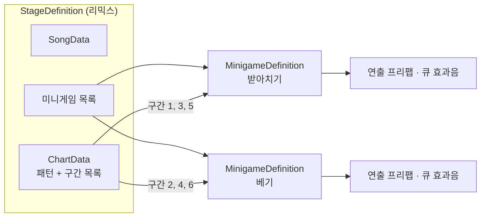
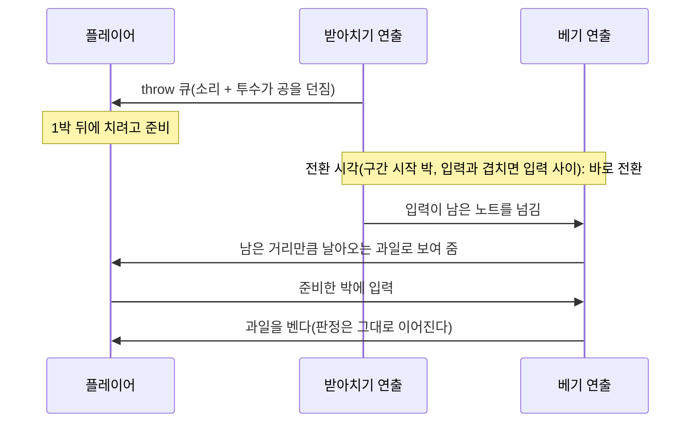

# 미니게임 연출 규칙

모든 미니게임이 따라야 할 규칙이다. 받아치기와 베기를 한 곡 안에서 번갈아 플레이하는 리믹스 프로토타입으로 정했다. 새 미니게임을 만들거나 기존 미니게임을 고칠 때 이 문서를 기준으로 한다.

## 1. 구성 단위

| 단위 | 에셋 | 내용 |
|---|---|---|
| 미니게임 | `MinigameDefinition` | 연출 프리팹, cueId별 큐 효과음, 배경색·HUD 글자색·카메라 크기. 곡과 채보는 갖지 않는다 |
| 패턴 라이브러리 | `PatternLibrary` (에디터 전용) | 미니게임의 패턴 목록. 미니게임 스테이지와 리믹스가 같은 라이브러리를 쓴다 |
| 스테이지 | `StageDefinition` | 곡, 채보, 채보가 쓰는 미니게임 목록 |
| 구간 | `ChartData`의 `ChartSegment` | 곡의 한 구간을 맡는 미니게임(미니게임 ID, 시작 비트) |

- 미니게임 스테이지는 미니게임이 하나이고 구간이 없다(곡 전체가 한 구간).
- 리믹스는 구간이 여럿이고 구간마다 미니게임이 하나다. 같은 미니게임이 여러 번 나와도 된다.
- Addressables 그룹은 미니게임마다 하나(`Minigame_*`), 스테이지마다 하나(`Stage_*`)다. 스테이지 번들은 미니게임 번들을 의존할 뿐 복사하지 않는다.

## 2. 구간 들어오기·나가기

연출은 구간이 시작하는 박에 **전환 연출 없이 바로** 바뀐다. 채보가 한창 나오는 중이어도 기다리지 않는다.

단, 전환이 입력(누름·뗌)과 겹치면 안 된다. 입력하는 순간 화면이 바뀌면 그 입력의 타격 모습이 보이지 않고, 어느 미니게임이 받았는지도 모호해진다. 그래서 전환 시각(`SegmentSwitch`)은 이렇게 정한다.

| 경우 | 전환 시각 |
|---|---|
| 구간 시작 박이 앞뒤 입력과 0.12초(`ClearanceSeconds`) 이상 떨어져 있다 | 구간 시작 박 그대로 |
| 가까운 입력이 있고, 그 박이 들어 있는 입력 사이 빈틈이 0.24초 이상이다 | 구간 시작 박에서 가장 가까우면서 양쪽 입력과 0.12초 떨어진 시각 |
| 빈틈이 0.24초보다 좁다 | 빈틈 한가운데 |
| 위 시각이 앞 구간 마지막 큐보다 앞이거나 다음 구간 첫 큐보다 뒤다 | 그 범위 안으로 당긴다(큐 모습이 그 큐의 미니게임에서 나와야 하므로 큐 조건이 우선) |

예: 124 BPM에서 노트가 구간 시작 박(32박)과 32.5박에 있으면, 두 입력 사이 0.24초의 한가운데인 32.25박에 바꾼다. 32박 노트는 앞 미니게임이 받아 타격 모습까지 보이고, 32.5박 노트는 다음 미니게임이 이어받는다. 채보 생성기는 이 시각이 늘 입력 사이에 들어갈 수 있게 채보를 만든다(5절).

그 순간에 앞 미니게임에서 입력이 남은 노트(날아오는 중인 물건, 누르고 있는 홀드)는 다음 미니게임이 **이어받는다**. 플레이어는 앞 미니게임의 큐를 보고 듣고 입력을 준비했는데, 입력하는 순간에는 화면이 바뀌어 있고, 바뀐 미니게임이 그 입력을 받아 처리한다.

전환 순서(전환 시각 S):

1. S까지 지난 큐·패턴 준비·판정을 앞 연출에서 마저 처리한다. 프레임이 밀리거나 입력이 먼저 와도 사건이 시간 순서대로 일어난다.
2. 앞 연출 `ExitSegment`(숨김) → 다음 연출 `EnterSegment`(나타남, 초기화).
3. 앞 구간 노트 중 판정이 끝나지 않은 것을 다음 연출의 `OnCarryNote`로 하나씩 넘긴다(`CarriedNote`: 노트, 예고 큐, 이미 누르고 있는지).
4. 카메라 배경색·HUD 글자색·카메라 크기를 그 미니게임에 맞춘다.
5. 다음 구간 패턴은 이때부터 준비한다(다음 구간 패턴의 큐는 S 이후라 늦지 않다).

연출(`StagePresenter`)이 지킬 것:

1. **들어올 때 상태를 처음으로 되돌린다.** `OnSegmentEnter`는 추상 메서드라 모든 연출이 구현해야 한다. 치울 것:
   - 진행 중인 물체(공, 물건)와 효과(번쩍임, 조각, 칼자국)
   - 홀드 링(`HoldRingDriver.Reset`)
   - 등장인물의 크기·각도·자세
   - 시간 기록(마지막 휘두른 시각, 마지막 큐 시각 등)
   - 플레이어 오타마톤(`OtamatonView.Rest`)
2. **어떤 미니게임의 노트든 이어받는다.** `OnCarryNote`도 추상 메서드다. 앞 미니게임의 cueId는 모르므로 노트 정보만으로 자기 모습을 고른다.
   - 탭: 예고부터 입력까지의 간격(`LeadBeats`)으로 1박 물건·2박 물건을 고른다(1.5박 이상이면 2박 물건).
   - 홀드: 자기 홀드 물건과 링(`HoldRingDriver.Begin(note, Holding)`). 이미 누르고 있으면(`Holding`) 붙잡은 모습과 입 벌린 오타마톤으로 시작한다.
   - 물건은 예고 시작 박(`LaunchBeat`)부터 날아온 것으로 계산해 **진행된 자리에 바로** 보이고, 입력 박에 타격 지점에 닿는다.
3. 곡을 처음 시작할 때도 `OnSegmentEnter`가 불린다. `OnBind`에서는 참조와 기준값(처음 크기 등)만 저장한다.
4. 나갈 때(`OnSegmentExit`)는 보통 아무것도 하지 않는다. 나간 연출은 숨겨지고 Tick을 받지 않으므로, 남은 것은 다음에 들어올 때 치운다.
5. 오브젝트는 연출 루트의 자식으로 만든다. 연출을 숨기면 함께 숨는다.
6. 위치와 애니메이션은 프레임 시간이 아니라 곡 시간·박으로 계산한다.
7. 다른 연출이나 HUD를 직접 건드리지 않는다. 화면 색은 `MinigameDefinition`에 둔다.

## 3. 이벤트 전달

| 이벤트 | 받는 연출 |
|---|---|
| `OnPatternSpawn`, `OnCue` | 그 패턴·큐가 속한 구간의 연출(항상 지금 구간이다) |
| `OnJudged` | 지금 구간의 연출. 앞 구간에서 이어받은 노트도 지금 연출이 판정을 받는다 |
| 입력(누름·뗌), `OnWhiff`, `OnBeat`, `Tick`, `OnPaused`, `OnStageFinished` | 지금 구간의 연출 |

입력은 들어온 시각에 화면에 있던 연출이 받는다. 입력이 전환 시각 이후에 들어왔는데 아직 전환을 처리하지 않았으면, 전환부터 처리하고 입력을 넘긴다.

패턴의 큐는 자기 구간 안에만 있으므로(5절) 패턴 준비·큐는 항상 지금 구간의 연출로 간다. 아니면 `StageRunner`가 경고를 남기고 `StrayEventCount`로 센다.

판정과 점수는 `Judge`와 `ScoreTracker` 하나로 곡 전체에 이어진다. 구간이 바뀌어도 판정 범위, 입력 보정, 정확도 계산은 그대로다.

## 4. cueId 구분 규칙

- cueId는 **미니게임 안에서만 유일하면 된다.** 받아치기 `tick`과 베기 `tick`처럼 미니게임끼리 겹쳐도 된다.
- 채보의 패턴은 구간 번호(`PatternInstance.segment`)를 갖는다. 코어는 큐 효과음을 그 구간 미니게임의 효과음 표에서 찾고, 연출에는 접두사 없는 원래 cueId를 넘긴다.
- 큐 소리와 모습은 항상 큐가 울리는 순간 화면에 있는 미니게임의 것이다. 노트를 이어받은 미니게임은 앞 미니게임의 cueId를 해석하지 않는다(2절).
- 같은 cueId는 항상 같은 간격 뒤의 입력을 뜻한다. 플레이어는 큐 종류만 듣고 입력 타이밍을 알 수 있어야 한다.
- cueId는 영어 소문자 한 단어로 짓고(`throw`, `gong`), 미니게임마다 `{미니게임}Cues` 상수 클래스에 모은다.
- 스테이지를 로드할 때 스테이지가 쓰는 모든 미니게임의 큐 효과음과 연출용 오디오를 함께 미리 디코딩한다.

## 5. 채보 생성 규칙

- 패턴 라이브러리는 미니게임 것이다. 패턴의 cueId는 그 미니게임 연출이 해석하는 것만 쓴다.
- 리믹스 채보는 채보 생성 프로필의 구간 목록(미니게임, 패턴 라이브러리, 시작 마디)으로 만든다. 곡 전체를 한 번에 채우며, 구간 경계에서 쉬지 않는다.
- 패턴은 **큐가 들어가는 구간**의 미니게임 패턴에서 고르고, 그 구간에 속한다.
  - 큐는 모두 자기 구간 안에 있어야 한다.
  - 노트(뗌 포함)는 다음 구간으로 넘어가도 된다. 넘어간 노트는 다음 미니게임이 이어받는다.
  - 따라 치기는 응답까지 자기 구간 안에 둔다. 선반에 줄선 모습이 곧 응답 리듬이라 다른 미니게임이 이어받을 수 없다.
- 전환이 입력 사이에 들어갈 자리를 남긴다(2절).
  - 앞 구간 패턴의 입력은 다음 구간 시작 박 이전(그 박에 딱 맞는 것 포함)이거나, 그 박보다 `carryOverMinBeats`(기본 0.5박) 이상 뒤에 둔다. 그 사이에는 두지 않는다. 0.5박 이상 뒤의 입력이 다음 미니게임이 이어받는 입력이고, 바뀐 화면에서 날아오는 물건을 보고 입력할 시간이 있다.
  - 새 구간의 첫 패턴은 바로 앞 입력보다 `SegmentSwitch.ClearanceSeconds`(0.12초) 이상 뒤에 시작한다(첫 큐 기준).
  - 생성 정보에 구간마다 실제 전환 박, 옮긴 만큼, 가장 가까운 입력과의 거리가 남는다.
- 이어받기가 구간 경계마다 나오도록 그런 패턴에 가산점(`carryOverBonus`, 기본 0.25)을 준다. 반드시 나오게 하지는 않는다.
- 패턴끼리는 겹치지 않으므로(다음 패턴의 큐는 앞 패턴의 마지막 입력 뒤), 한 경계에서 이어받는 패턴은 많아야 하나다.
- 곡 앞 `leadInBars`(기본 1마디)와 곡 끝 `tailBeats`(기본 2박)는 비운다. 구간 경계에는 여백이 없다.
- 구간 경계는 마디 단위이고, 구간은 4마디 이상으로 둔다.
- 리믹스의 생성 난이도는 그 챕터 범위의 상한이다([01](01_CoreLoop.md) 3.1).

## 6. 연습 규칙

연습도 미니게임의 일부 구간만 쓰는 흐름이므로 리믹스 구간과 같은 규칙을 따른다. 흐름은 6단계(세션 루프 연결)에서 구현한다.

| 항목 | 규칙 |
|---|---|
| 채보 | 본 채보와 따로 연습 채보를 만든다. 단계 하나 = 구간 하나 = 가르칠 패턴 하나 |
| 단계 순서 | 패턴 라이브러리 순서대로, 스테이지 생성 난이도 이하 패턴만. 따라 치기 같은 특수 패턴은 마지막 |
| 생성 | 단계 구간마다 그 패턴 하나만 든 라이브러리로 생성한다. 구간 생성 규칙(5절)이 그대로 적용된다 |
| 연출 | 본 플레이와 같은 연출 인스턴스를 쓴다. 단계가 바뀔 때도 `ExitSegment` → `EnterSegment`를 거치고, 앞 단계에서 남은 노트는 이어받는다(같은 미니게임이라 화면은 그대로 보인다) |
| 곡 | 본 곡을 쓴다. 강도가 0인 도입부는 건너뛰고 시작한다 |
| 안내 | 단계마다 HUD에 안내 문구를 띄운다. 연출은 안내를 알 필요가 없다 |
| 판정 | 판정 피드백은 보여 주지만 점수·랭크·보상에는 넣지 않는다 |
| 본 플레이로 | 연출을 다시 들이고(초기화) 판정·점수를 새로 시작한다. 곡은 처음부터 |
| 건너뛰기 | 언제든 건너뛰어 본 플레이로 갈 수 있다 |

## 7. 시각 큐 기준

소리 없이도(무음 모드, 모바일) 큐를 알아보고 입력할 수 있어야 한다.

1. 모든 cueId는 소리가 나는 시각에, 또는 그보다 먼저 눈에 보이는 변화를 만든다.
2. 큐 종류끼리 모양·크기·움직임 중 하나 이상이 다르다. 색만으로 구분하지 않는다(색각 이상 대응).
3. 화면만 보고 입력 박을 알 수 있다. 날아오는 물체는 입력 박에 정확히 타격 지점에 도착한다.
4. 홀드는 뗄 박을 링(`ProgressRing` + `HoldRingDriver`)으로 보여 준다. 링이 다 차면 깜빡이고, 그때 뗀다.
5. 따라 치기는 콜마다 대상이 선반(`EchoShelf`)에 응답 리듬 모양대로 줄서고, 응답 박에 타격 지점으로 떨어진다.
6. 등장인물이 박마다 눌려 박을 보여 준다.
7. 판정 결과(Perfect / 아슬아슬 / Miss)가 모양과 움직임으로 구분된다. Miss면 물체가 회색으로 떨어지고 오타마톤이 Hit 눈이 된다.
8. 이어받은 노트도 같은 기준을 지킨다. 화면이 바뀐 순간 새 미니게임의 모습으로, 예고부터 남은 만큼 진행된 자리에 보이고, 입력 박에 타격 지점에 닿는다.

현재 미니게임 점검:

| 큐 | 받아치기 | 베기 |
|---|---|---|
| 1박 뒤 입력 | `throw`: 작은 공, 낮은 포물선 | `toss`: 둥근 과일, 낮은 포물선 |
| 2박 뒤 입력 | `lob`: 큰 공, 높은 포물선 | `high`: 길쭉한 대나무, 높은 포물선 |
| 홀드 | `charge`: 가장 큰 공 + 링 | `draw`: 가로로 긴 통나무 + 링 |
| 홀드 뗌 예고 | `tick`: 타격 지점이 번쩍임 | `tick`: 칼 위치에 고리 |
| 따라 치기 | `bell`: 투수 위 번쩍임 + 선반의 공 | `gong`: 징이 커지며 울림 + 선반의 등롱 |
| 박 표시 | 투수·타자가 눌림 | 스승·검객이 눌림 |
| 판정 | 멀리 날아감 / 덜 날아감 / 회색으로 떨어짐 | 두 동강 / 덜 벌어지고 흐려짐 / 회색으로 떨어짐 |
| 이어받기 | 탭은 예고 간격에 따라 `throw`·`lob` 공, 홀드는 `charge` 공 + 링 | 탭은 예고 간격에 따라 `toss` 과일·`high` 대나무, 홀드는 `draw` 통나무 + 링 |

두 미니게임 모두 기준을 만족한다. 모바일 실기기에서 다시 확인하는 일은 16단계에 있다.

## 8. 화면

- 배경색, HUD 글자색, 카메라 크기는 미니게임마다 `MinigameDefinition`에 둔다. 리믹스에서는 구간이 바뀔 때 함께 바뀐다.
- 입력 대상과 타격 지점은 가로 반폭 `minVisibleHalfWidth`(기본 7.5) 안에 둔다. 세로 화면에서도 카메라가 이 폭은 보여 준다.
- 플레이어 캐릭터는 `OtamatonView`를 쓴다. 입력 중에는 입을 벌리고, Miss면 잠시 Hit 눈이 된다.

## 9. 메모리

- 리믹스는 쓰는 미니게임의 연출을 처음에 미니게임마다 하나씩 모두 만들어 두고, 구간이 바뀔 때는 켜고 끄기만 한다. 전환 중에 로드하거나 새로 만들지 않으므로 끊김이 없다.
- 같은 미니게임이 여러 구간에 나와도 연출은 하나다(다시 들어올 때 초기화).
- 스테이지 로드 로그(`[StageContentLoader] 로드`)에 미니게임 수, 미리 디코딩한 오디오 크기, 전체 할당 메모리가 남는다.

프로토타입 측정(에디터, 2026-10-08): 미리 디코딩한 오디오가 받아치기 0.9MB, 베기 1.0MB, 리믹스(두 미니게임) 1.2MB였다. 미니게임 하나가 늘 때 더해지는 것은 그 미니게임의 효과음과 연출 인스턴스 하나뿐이다. 실기기 측정은 개발 빌드로 2·16단계에서 한다.

## 10. 점검 도구

- **자동 플레이**: `IWannabe/Test/Auto Play All Stages` 메뉴. 카탈로그의 모든 스테이지를 자동 입력으로 끝까지 플레이하고 결과를 로그(`[AutoPlay]`)로 남긴다. 모든 노트가 Perfect이고, 구간 전환 횟수가 구간 수 − 1이며, 엉뚱한 구간 이벤트가 0건이고, 전환과 입력 사이가 0.06초 이상이어야 통과다. 이어받은 노트 수와 전환·입력 최소 간격도 함께 남는다. 클리어 기록은 남기지 않는다.
  - 스테이지마다 화면을 두 장(디버그 패널 자세히·간단히) `Temp/AutoPlayShots`에 남긴다. 리믹스는 첫 구간 전환 직후, 이어받은 노트가 날아오는 중일 때 찍는다.
- `StageRunner`의 `autoPlay`를 켜면 플레이 씬 하나만 자동으로 돌려 볼 수도 있다.
- **디버그 패널**(`StageDebugPanel`): 에디터·개발 빌드의 플레이 화면 왼쪽에 뜬다. F3을 누를 때마다 자세히 → 간단히 → 끄기로 바뀐다.
  - 자세히: 스테이지·상태, 곡 시간·마디·박·BPM, 지연 보정, 구간과 다음 전환까지 남은 박, 다음 전환 박(구간 시작에서 옮겨졌으면 그만큼)과 가장 가까운 입력까지의 거리, 전환·이어받기·엉뚱한 구간 이벤트 수, 지금 치는 패턴(큐·노트, 상대 박, 판정 결과, 이어받는 중 표시), 다가오는 노트 5개(남은 ms), 판정 수·지금까지 정확도·랭크·평균 오차와 표준편차·최근 판정, 입력 상태, fps, 채보 생성 정보
  - 간단히: 위 내용을 몇 줄로 줄여, 화면 왼쪽 아래(투수·스승 쪽)를 가리지 않는다
  - 평균 오차는 입력 보정값을 맞출 때 참고한다(음수면 빠르게, 양수면 늦게 누르는 편)

## 11. 새 미니게임 체크리스트

- [ ] `{미니게임}Cues` 상수. cueId마다 입력까지의 간격을 고정한다
- [ ] `StagePresenter`를 상속하고 `OnSegmentEnter`에서 2절의 항목을 모두 초기화한다
- [ ] `OnCarryNote`로 다른 미니게임의 탭(1박·2박 간격)과 홀드(누르기 전·누르는 중)를 자기 모습으로 이어받는다
- [ ] 7절 시각 큐 기준 표에 줄을 채운다
- [ ] `MinigameStageRecipe` 레시피: 패턴, 큐 효과음, 연출 프리팹, 배경색·HUD 글자색
- [ ] 자동 플레이 통과
- [ ] 리믹스 구간으로 넣어 다른 미니게임과의 전환을 확인한다
